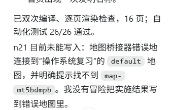

# 新节点11

要进行隔离 这个就是会同时运行多个地图 多个agent 那么并发性如何处理 一个典型的场景是 我用codex在写专利地图 的时候 我点击快捷方式 启动了 第二个浏览器 这个时候我第一个项目的桥就会返回第二张地图的地址 

这个就是典型场景 思考解决办法 是否需要一个显式的管理界面进行管理？

因为人这里就很正常 我打开浏览器 哪个项目就是哪个项目 哪张地图就是哪张地图 然后浏览器到桥直接写入磁盘 我开好多浏览器 多个项目 多张地图 一点问题没有

重要的是要管理与agent交互的地图 是哪个项目 哪张地图 这个要确认或者可以直接指定