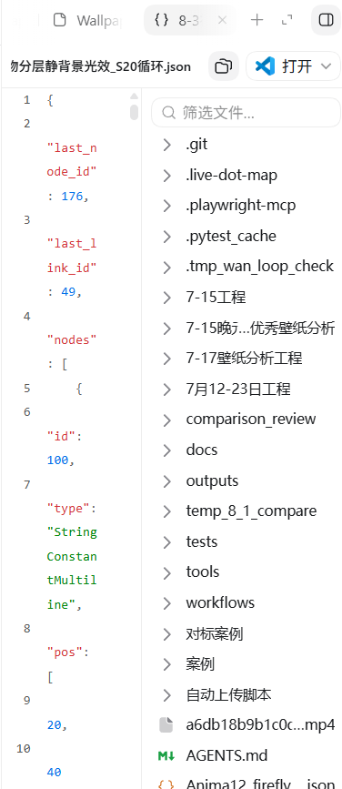
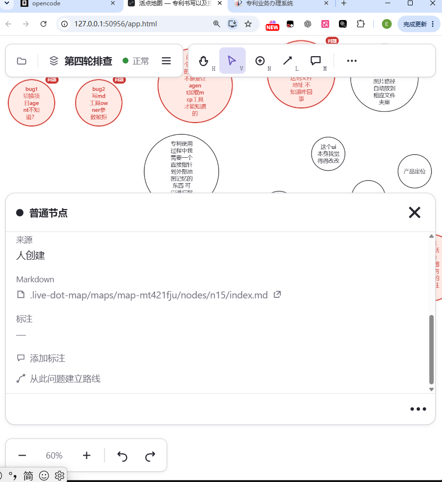
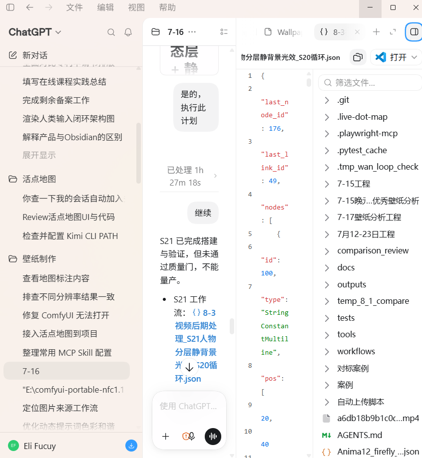

# P1 批次：编辑器体验（n8 图片决策 → n5 侧边栏重构）

待排期。前置：先定 n8（内置编辑器是否支持图片粘贴入库），再做 n5（侧边栏 UI）。
### P1 决策清单（agent 建议稿，2026-08-29）

> 前提更新：P0（n7/n9/n12）已提交 master（0121cca），测试 207 过 0 挂；P1 在 `ui-fix` 分支开发。
> 参考图已就位：n5 节点里存的 codex 截图（image.png）agent 已读过。目标形态 = 右侧 dock 面板：顶部文件名+操作、中间带行号的编辑区、内侧文件树。你不用再发，除非想补细节。

**决策 1（n8）图片功能方向：补齐 / 维持现状 / 砍掉**
- 现状（探查结论）：「粘贴图片 → 自动入库 → 插入 Markdown」的链路**已经存在**（app.html 的 paste 处理 + importAsset）。真正的缺口是：预览把图片渲染成 `[alt]` 纯文本（看不到图）、非桥接模式直接拒绝、从资源管理器复制文件路径粘贴无处理。
- **推荐：补齐**（预览渲染图片 + 路径粘贴也入库）。理由：链路已通，补齐是小活；砍掉等于废弃已有代码还丢掉体验闭环。 好的补齐
- 待你确认：你说的「跟外部 VSCode 冲突」具体是哪种场景——同一份 md 两边同时改导致保存冲突？还是图片本身的问题？这决定要不要顺便加「外部已修改」提示。   外部vscode冲突 就是我测试是在粘贴图片的场景下必然出现 因为之前没改之前 在编辑器里修改图片不会实际入库 只有路径 不过可能有更深层的原因 在这个决策1修改之后进行判定

**决策 2（n5）侧栏形态**
- **推荐：右侧 dock、非模态**，地图保持可点可拖；默认宽度约半屏（按 codex 截图比例），可拖拽调宽并记忆。 就这样
- 备选：保持弹层只缩小——不推荐，没解决「看着地图对照着写」的核心诉求。

**决策 3：点另一个节点时侧栏怎么办**
- **推荐：内容直接切换到新节点**；当前有未保存改动时先弹确认（保留/放弃）。理由：非模态的意义就是随点随看；不拦会丢稿，拦死又不顺手。 好的可以 弹确认接受

**决策 4：资料包文件列放哪**
- **推荐：保留为侧栏内侧的窄文件列**（像 codex 面板里的文件树），可折叠；窗口太窄时自动收成下拉。 可以

**决策 6：顶栏与操作排布**
- 照 codex 面板直接定，不需你决策：顶部一行 = 文件名 + 编辑/预览切换 +「打开」外部编辑器菜单 + 关闭；保存状态条留底部。

**已由 P0 覆盖、不再重复**：节点标题旁红点「冲突」误报（n5 image-1 的症状）就是 n7 状态灯拆分修的问题，已修好。

决策7发现小问题 就是我在节点里这个资料包里面的文件名字或者路径不能右键复制引用 不够细致 可以顺手修掉

决策8 我觉得可以编辑就这个ui本身能否提供一个文字不同颜色的场景 因为agent自己写入的文字 保持默认 而人打字输入的颜色 在编辑器里可以高亮 或者黄色 比较显眼一点 具体颜色用户可以选择几个  这样好区分 人打的字还是agent自己的字 一般来说对于用户自己打的字王婉更加重要 不仅是视觉侧比较清晰 新的agent扫描的时候也知道什么文字是人写的 什么是agent输出的一些执行记录什么的 当然人也可以把agent输出的文字高亮 这样

决策9 前面一直是交互的 还要设计也非常重要  
设计必须这种现代的感觉 同时符合我的的简约的品牌调性 不要做的像一个demo一样  codex的设计就很简约的 我们也是一样 是一个轻量的功能 目前这个button 和这个页面 我都不喜欢 你可以说说你打算怎么改 怎么呈现 还有  我在写程序的时候都是这样半屏看的 而这个节点面板直接挡住实现 还没有办法自由压缩拉伸 非常难受 还有当设计侧边栏的时候 需要思考 在半个屏的情况下 我再点击这个md文档打开 视觉上怎么呈现 我不是设计师 但我可以给你参考  codex我同样是半个屏幕使用的 但它通过左上角 右上角的两个按钮可以展开收起做到了很好 每个屏幕都有信息 那么我们的场景应该如何设计呢？
---

### 决策 8 更新（2026-08-29，用户要求跨会话留痕）

最终方案：**实时高亮 + 保存固化 `<mark>`**。

- 打字时 diff 实时高亮不变；保存那一刻把改动段自动包 `<mark>…</mark>` 写入文件。
- 重开文件 `<mark>` 段继续渲染所选颜色（默认黄）→ 跨会话留痕；agent 读文件即可区分人写内容。
- 工具条按钮支持手动对选中段加/去标记（人也可标记 agent 的重要输出）。
- 编辑器里标签淡化显示；颜色是显示层偏好不进文件；`<mark>` = 人写 的约定补进 agent 协议文档。
- 代价（已接受）：VSCode 里裸看文件能看到 `<mark>` 标签。
- 被否：sidecar 区间文件（外部编辑后漂移失真）。

详细计划：`docs/plans/2026-08-29-p1-编辑器右侧栏.md`（T1~T7，待用户确认后开工）。
> 更正（agent）：上一条里的计划文档已按用户要求从 docs/plans/ 移到本节点资料包 → **p1修改计划.md**，后续执行记录也追加在那里。
---

### 状态更新（2026-08-30）

**P1 已全部实施完毕**（分支 `ui-fix`）：T1/T2 右侧 dock + 编辑器迁入、T3 行号槽 + 人写高亮 + `<mark>` 保存固化、T4 图片预览渲染 + 本地路径粘贴入库、T5 文件列右键复制引用、T6 codex 质感打磨 + brand-spec 同步。逐步走查截图在 `走查截图/p1/`，执行记录与决策细节见本节点 **p1修改计划.md**。待用户过目验收后合并回 master。