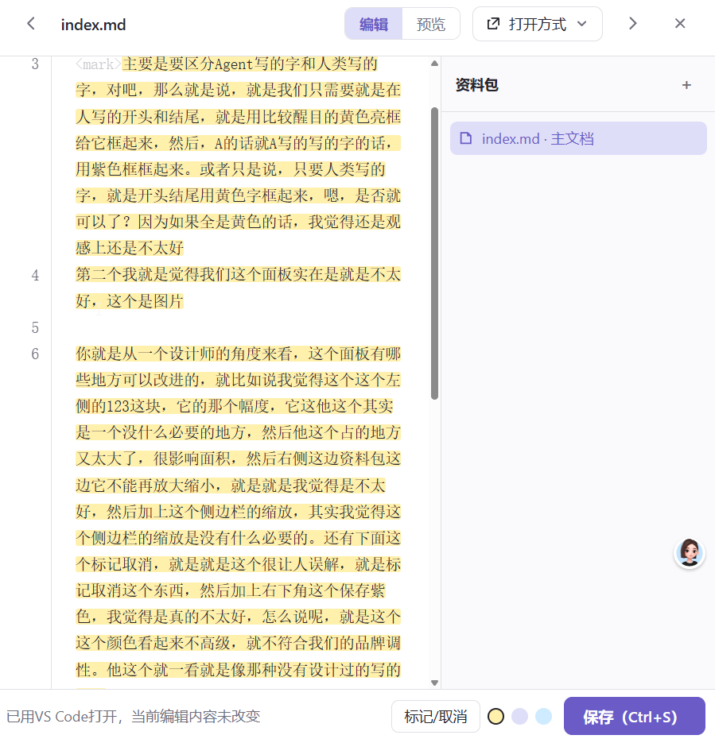

# 新节点25

主要是要区分Agent写的字和人类写的字，对吧，那么就是说，就是我们只需要就是在人写的开头和结尾，就是用比较醒目的黄色亮框给它框起来，然后，A的话就A写的写的字的话，用紫色框框起来。或者只是说，只要人类写的字，就是开头结尾用黄色字框起来，嗯，是否就可以了？因为如果全是黄色的话，我觉得还是观感上还是不太好
第二个我就是觉得我们这个面板实在是就是不太好，这个是图片

你就是从一个设计师的角度来看，这个面板有哪些地方可以改进的，就比如说我觉得这个这个左侧的123这块，它的那个幅度，它这他这个其实是一个没什么必要的地方，然后他这个占的地方又太大了，很影响面积，然后右侧这边资料包这边它不能再放大缩小，就是就是我觉得是不太好，然后加上这个侧边栏的缩放，其实我觉得这个侧边栏的缩放是没有什么必要的。还有下面这个标记取消，就是就是这个很让人误解，就是标记取消这个东西，然后加上右下角这个保存紫色，我觉得是真的不太好，怎么说呢，就是这个这个颜色看起来不高级，就不符合我们的品牌调性。他这个就一看就是像那种没有设计过的写的面板

然后第四个问题就是我们需要讨论的就是一个。一个功能上的问题，就是说我们这个节点除了它的语义，除了普通问题，是否还需要一个已解决，因为有些问题是已解决的，那我已经解决，我就可以给它变成已解决，然后节点可以变成绿色或者灰色，这样子，就是归档一下，然后下次Agent去读取的时候，就可以不用再读取以前的老的那些已解决的问题。就是这个东西，可以让人去选择是否归档。他这个归档，可能不懂嘛，就是普通人就是他，但他等已解决啊，他就是他这个问题解决了，那就那就可以变把它变成灰色或者绿色怎么样的就是放到一边，然后Agent读全局的时候，因为全局它Agent能肯定是直接直接直接读那个全局的一些地图，就有些有些节点可以忽略了。就当节点越来越多的时候，这本身提供一个可以整理的方式，我觉得还是不错的

然后就是第四个问题就是说就当我更改了这个就现在就是说。就是我一旦就是去嗯去面板里，就是去那个MD文件里去编辑编辑一个文字，它自动把前面的文字变也变成标记了，变成黄色，就是这是一个，我觉得是一个比较大的bug

<!-- @author: agent:antigravity -->
## 🤖 Agent（Antigravity）回复与演示

你好！这里就是由 Agent（Antigravity）追加的内容。在活点地图中，人机笔迹是有双轨自动标注机制的：

### 1. 自动标注的显示效果演示
- **人类笔迹（上方段落）**：默认纯净文本，无多余边框干扰。
- **Agent 笔迹（当前段落）**：左侧带 Notion 式紫色微标与发丝折角，首尾闭合。
- **切换到「预览」模式**：Agent 撰写的内容会自动封装在独立卡片内，顶部附带 `🤖 agent:antigravity` 专属徽标。

### 2. 关于“为什么前面文字会自动变黄”的原因与解答
- 在过去的流式继承设计中，作者标记会向下无界渗透。
- 方案 C 全面采用**成对闭合块**（`<!-- @author: agent --> ... <!-- /@author -->`），块外 100% 自然纯净，彻底消除了下染扩散。

### 3. 关于面板设计的建议与 Zen 方案落地
你之前在图片中指出的几点，在当前的极简禅意（Zen）方案中已经解决：
- **行号槽占用过大**：已去除笨重的 123 行号栏，文本顶格呼吸，净阅读面积大幅增加；
- **侧边栏无级伸缩**：资料包支持自由拖拽调宽，双击分割线即可秒级折叠至贴边；
- **消除歧义操作**：底部的标记/取消操作已收拢到右下角极简的微型「✦ 标记 ▾」微面板；
- **按钮色彩高级化**：原先扎眼的实心紫色保存按钮已改用极简工业灰白幽灵质感，与整体黑白灰品牌调性保持克制与统一。

### 4. 关于“已解决”节点与归档设计（深度赞同）
你的这个建议非常切中人机协同的核心痛点：
- **视觉归档**：普通节点（琥珀灰/默认）、问题节点（品红警示），新增「已解决节点（静谧冷灰/灰绿+完成对勾）」；
- **Agent 检索优化**：地图越来越大时，Agent 巡检可默认传参 `excludeResolved: true`，忽略已解决节点，既省 Token 又避免旧问题反复误判；
- **人类复核体验**：人类随时可以在图谱上筛选或淡化显示已解决节点，既保留了上下文线索，又让画布保持清爽。
<!-- /@author -->

撒大苏打
