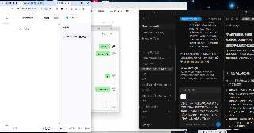
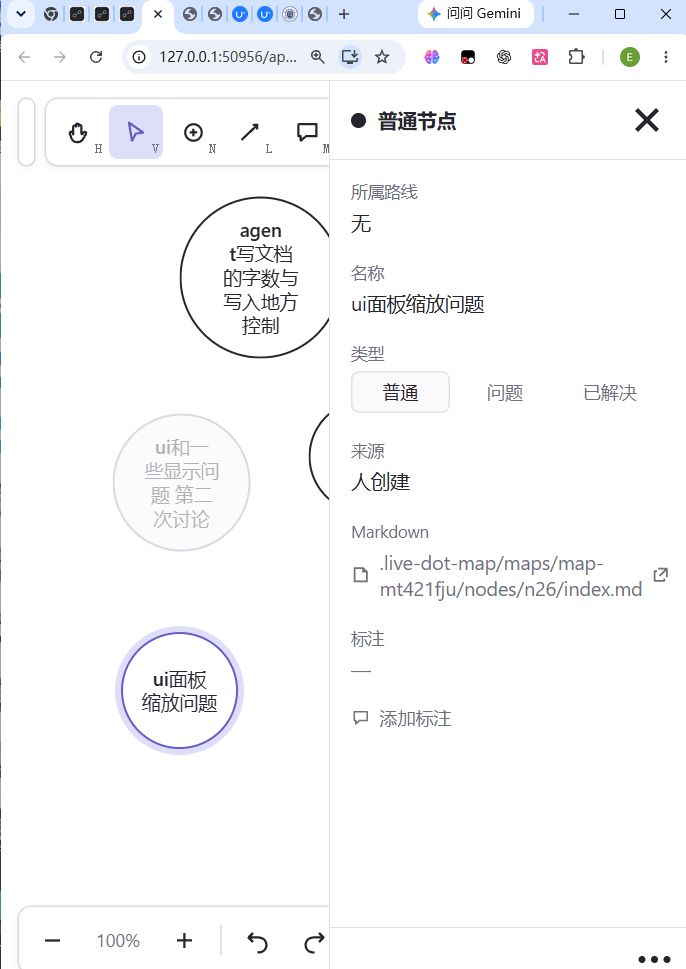

# 新节点27

先讨论再执行 现在 还有小问题 这个最左边的箭头和 和最右边的叉叉这个功能实际上是重复的  对吧 然后最左边这个箭头我觉得反了 比如说应该是一个右箭头 点击变成节点详情面板  然后你看下第二张图片 这个index的主要写编辑面板 我觉得也应该支持一个无极缩放

然后 
看下这张图片 就是我一般使用大小就这么大 然后这个节点详情的面板 也应该无极缩放 不然看不清整个地图 第二个 左上角这个项目 文件本身有选择文件夹 地图 设置三种主要功能吧但是缩放到这个大小的时候 只剩项目文件夹  甚至项目文件夹都不能点击 考虑下怎么办 是点击后可以向下展开三个主要按钮吗 还是怎么做 可以做到功能可以点击也保持简洁 我不是ui设计师 你跟我讨论一下 确定最优化方案

---

## 优化实施方案与验证记录（2026-09-10）

### 1. Markdown 头部导航解耦
- **左侧返回键**：重构为 `‹ 详情`（`.mdv-back-btn`），文字加箭头明确表意，点击平滑返回属性卡片；
- **右侧关闭键**：保留 `✕`（`.mdv-close`），点击彻底关闭整个右侧侧栏抽屉（`select(null)`），恢复全画布开阔视野；
- 未保存编辑时均接入 `confirmDialog` 二次阻断，防止内容丢失。

### 2. 面板无极缩放与磁吸折叠
- 最小宽度下探：普通属性面板允许收缩至 180px，Markdown 编辑器允许收缩至 280px；
- 调宽手柄 `#dock-grip` 扩展为 14px 宽热区，悬停/拖拽时呈现淡紫垂直 pill 指示条；
- 磁吸折叠：拖拽宽度 < 110px 时自动吸附折叠至 36px 停靠条（`.rail`）；双击手柄快速在折叠与历史记忆宽度之间复原。

### 3. 窄屏/分屏自适应防遮挡（450px 分屏）
- 依据 `window.innerWidth - dockWidth` 动态判定 `.narrow-dock` 与 `.tiny-dock`；
- **项目药丸折叠**：左上角 `#project-pill` 自动精简为单个 38x38px 图标按钮，隐藏文本与多余按钮，点击展开 5 合 1 聚合菜单（项目选择、地图切换、设置中心、整理地图、新手引导）；
- **工具栏防遮挡**：微型化（32x32px）、隐藏按键提示；超窄视口下将「新建方案线」与「添加标注」自动收归 `#more-btn` 省略号菜单内；底部缩放条自动隐藏撤销/重做，实现与右侧抽屉面板严格零像素物理重叠。

### 4. 验证结果
- 全量自动化测试：`npm test` 230 项全部通过（pass 230, fail 0）；
- 端到端 Playwright 验证通过，截屏归档：
  - `tools/31-markdown-nav-decoupled.png`：导航按钮解耦（左 `‹ 详情`，右 `✕`）
  - `tools/32-narrow-dock-no-overlap.png`：450px 窄窗口零遮挡与 38px 紧凑项目药丸
  - `tools/33-compact-nav-menu.png`：紧凑项目药丸展开聚合导航菜单
  - `tools/34-narrow-toolbar-more-menu.png`：次级工具完整折叠进更多菜单