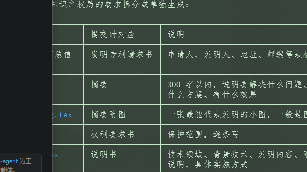

# 新节点15

1.找一篇高质量已授权专利当模板
   可以找一个相近领域（AI 助手、知识管理、协同办公、记忆系统）的发明专利，学习它的：
   • 权利要求书的句式结构
   • 说明书"背景技术—发明内容—有益效果—具体实施方式"的衔接方式
   • 附图说明的写法

 实施例越多越好授权
      专利审查的核心是"技术方案是否清楚、完整、可实施"。纯架构图和流程图容易显得抽象，审
      查员可能会质疑"这到底怎么落地"。加上产品界面截图，能直接证明：
       • 技术方案已经实现
       • 人机协同的交互方式是真实存在的
       • 地图节点、资料包、卡片索引这些概念有具体落点

产品已经实现所有实施例都可以补充 每个提案都有明确的使用案例 既然越多越好我就做到最好 能截图的都截图了 你负责告诉我需要截图什么就行

3.完成 1 2 步骤后 去找一下有没有专利排版 或者清晰排版的skill 可以下载使用 
到这一步 停下来 我看看 是根据对标专利优化文案  还是直接用skill写 再决定 整体统一重写可以 目前的不管是文字 还是排版我都不满意 

