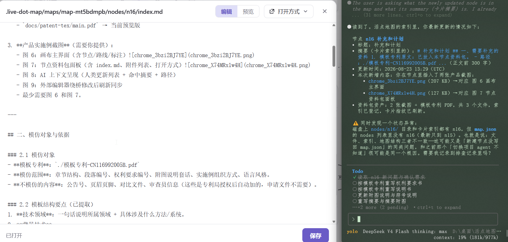
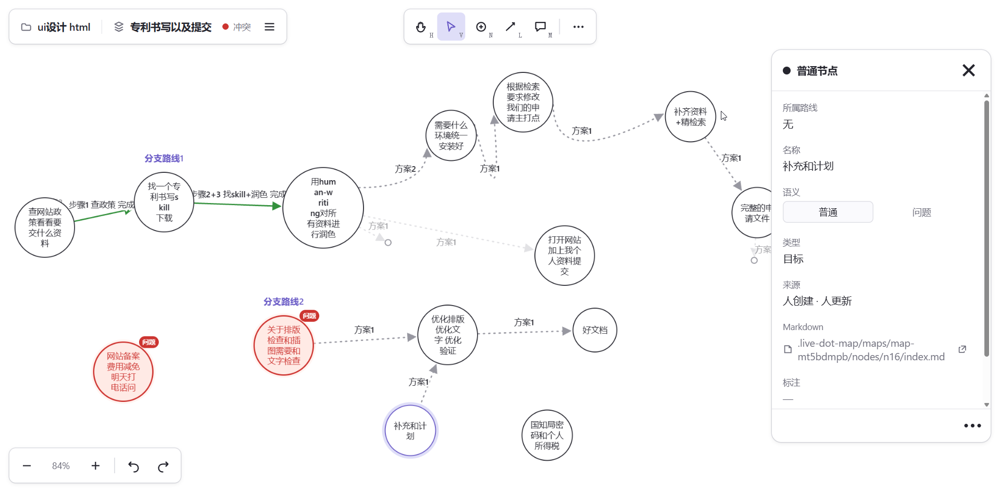
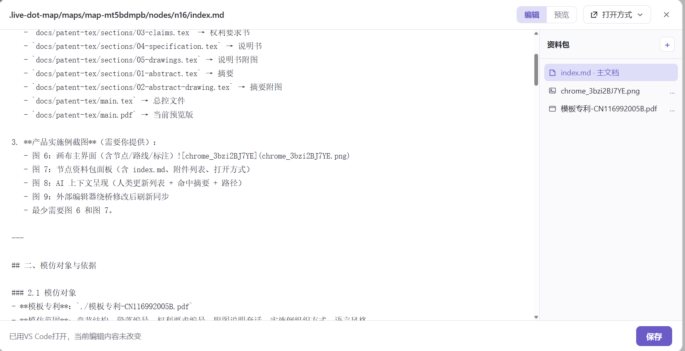
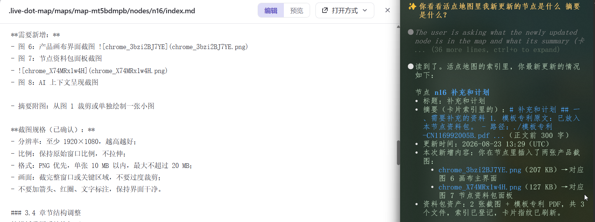

# 补充和计划

## 一、需要补充的资料

1. **模板专利原文**：已放入本节点资料包。
   - 路径：`./模板专利-CN116992005B.pdf`
   - 来源：Google Patents，CN116992005B，语仓科技，「基于大模型及本地知识库的智能对话方法、系统及设备」。
   - 页数：16 页（授权公告版）。

2. **当前专利 LaTeX 源文件**（需要修改）：
   - `docs/patent-tex/sections/03-claims.tex` → 权利要求书
   - `docs/patent-tex/sections/04-specification.tex` → 说明书
   - `docs/patent-tex/sections/05-drawings.tex` → 说明书附图
   - `docs/patent-tex/sections/01-abstract.tex` → 摘要
   - `docs/patent-tex/sections/02-abstract-drawing.tex` → 摘要附图
   - `docs/patent-tex/main.tex` → 总控文件
   - `docs/patent-tex/main.pdf` → 当前预览版

3. **产品实施例截图**（需要你提供）：
   - 图 6：画布主界面（含节点/路线/标注）

   - 图 7：节点资料包面板（含 index.md、附件列表、打开方式）
   - 图 8：AI 上下文呈现（人类更新列表 + 命中摘要 + 路径）
 - ）

 

---

## 二、模仿对象与依据

### 2.1 模仿对象
- **模板专利**：`./模板专利-CN116992005B.pdf`
- **模仿范围**：章节结构、段落编号、权利要求编号、附图说明套话、实施例组织方式、语言风格。
- **不模仿的内容**：公告号、页眉页脚、对比文件、审查员信息（这些是专利局授权后自动加的，申请文件不需要）。

### 2.2 模板结构要点（已提取）
1. **技术领域**：一句话说明所属领域 + 具体涉及什么方法/系统。
2. **背景技术**：
   - 先点出现有技术热潮/代表产品；
   - 用「其一、其二、其三、其四、其五」列 4–5 条共同局限；
   - 最后一句总结「综上，现有技术可靠性较低」。
3. **发明内容**：
   - `[0008]` 写目的：「本发明的目的是提供一种……，可提高……」。
   - `[0009]` 写方案：「为实现上述目的，本发明提供一种……方法，包括：」。
   - 逐条展开方法步骤（1）（2）（3）……
   - 再写系统模块和存储介质。
4. **附图说明**：
   - 固定套话：「为了更清楚地说明本发明实施例或现有技术中的技术方案……」。
   - 「图 1 为本发明提供的……流程图。」
   - 「图 2 为……示意图。」
   - 最后加「符号说明：201‑数据获取模块，202‑编码模块……」。
5. **具体实施方式**：
   - 开头固定免责句：「下面将结合本发明实施例中的附图……」。
   - 实施例一：方法步骤化；
   - 实施例二：系统模块，每个模块对应权利要求中的步骤；
   - 实施例三：电子设备 + 计算机可读存储介质。
   - 结尾段：保护范围声明。
6. **有益效果**：单列一段，逐条写「1、……2、……」。

---

## 三、详细模仿计划

### 3.1 排版与格式
| 项目 | 模板做法 | 我们的做法 |
|---|---|---|
| 纸张 | A4 | A4（已设置） |
| 页边距 | 适中，约 2.5cm | 已设置，保持不变 |
| 正文字体 | 宋体 | 使用 `xeCJK` 宋体 |
| 标题 | 黑体加粗 | 已使用 `\textbf` |
| 段落编号 | `[0001]`、`[0002]` 五位编号 | 已使用 `\paragraphno` |
| 行距 | 1.5 倍左右 | 已设置 `1.5` |
| 图注 | 「图 1 为……」五号字居中 | 已使用 `\caption`，检查去掉英文 Figure |
| 权利要求 | 顶格，编号顶格，后续缩进两字 | 检查 `claimitem` 环境 |

### 3.2 字体
- 中文正文：宋体（`SimSun`）
- 中文标题：黑体（`SimHei`）
- 英文/代码：Times New Roman 或等宽字体
- 代码路径：保留 `\zonecode` 等宽样式，但专利正文中尽量少出现代码路径，改成自然语言描述。

### 3.3 附图
当前已有 5 张 tikz 流程图：
1. 图 1：四级分层记忆架构及访问规则
2. 图 2：保存即建卡的写入流程
3. 图 3：查询下探的读取流程
4. 图 4：双写与绕桥修改自愈流程
5. 图 5：人类输入信号闭环状态流转

**需要新增：**
- 图 6：产品画布界面截图 
- 图 7：节点资料包面板截图
- 
- 图 8：AI 上下文呈现截图

- 摘要附图：从图 1 裁剪或单独绘制一张小图

**截图规格（已确认）：**
- 分辨率：至少 1920×1080，越高越好；
- 比例：保持原始窗口比例，不拉伸；
- 格式：PNG 优先，单张 10 MB 以内，最大不超过 20 MB；
- 画面：截完整窗口或关键区域，不要过度裁剪；
- 不要加箭头、红圈、文字标注，保持界面干净。

### 3.4 章节结构调整
按模板重写后结构如下：

**说明书（`04-specification.tex`）**
1. 技术领域（1 段）
2. 背景技术（先分类现有技术，再列 5 条局限）
3. 发明内容
   - 要解决的技术问题
   - 技术方案（方法步骤 1–4）
   - 系统模块
   - 存储介质
4. 有益效果（逐条列）
5. 附图说明（套话 + 5/9 张图说明 + 符号说明表）
6. 具体实施方式
   - 实施例一：总体架构与数据布局
   - 实施例一续：卡片索引生成
   - 实施例一续：廉价指纹校验
   - 实施例一续：上下文按需下探
   - 实施例二：人类输入信号闭环
   - 实施例三：资产路径化下探
   - 实施例四：崩溃一致与并发安全
   - 实测数据
   - 变体与扩展

**权利要求书（`03-claims.tex`）**
- 权利要求 1：方法，分 4 个步骤
- 权利要求 2–5：从属权利要求
- 权利要求 6：系统
- 权利要求 7：存储介质

**摘要（`01-abstract.tex`）**
- 300 字以内，概括方法、系统、效果。

**摘要附图（`02-abstract-drawing.tex`）**
- 一张图 1 的简化版。

---

## 四、文字优化重点

1. **去掉口语化比喻**：
   - ❌ "token 成本失控" → ✅ "上下文占用线性膨胀，推理开销随记忆规模增长而增加"
   - ❌ "智慧又省钱" → 不出现在专利中

2. **避免过细的代码常量**：
   - ❌ "源码常量 `SUMMARIZED_WINDOW = 300`，位于 `src/bridge/md-index.mjs`" → ✅ "摘要取正文前 300 字"
   - 代码路径只在必要时作为可选实施例出现，或放到「变体与扩展」中说明。

3. **权利要求书语言**：
   - 使用「所述」「进一步地」「其特征在于」等专利常用词。
   - 一条权利要求只写一个层次，不要太长。

4. **实施例写法**：
   - 从用户操作角度描述完整流程，而不是从代码实现角度。
   - 例如：「用户在画布上创建节点并输入标题后，系统……」

---

## 五、下一步行动

1. 你确认截图清单并提供图片路径；
2. 我按模板重写 `03-claims.tex`、`04-specification.tex`；
3. 我更新 `05-drawings.tex` 的附图说明和符号说明；
4. 我重写 `01-abstract.tex` 和 `02-abstract-drawing.tex`；
5. 插入产品截图并重新编译 `main.pdf`；
6. 输出最终合规性检查表。

---

## 六、参考路径汇总

- 模板专利：`./模板专利-CN116992005B.pdf`
- 当前权利要求书：`../docs/patent-tex/sections/03-claims.tex`
- 当前说明书：`../docs/patent-tex/sections/04-specification.tex`
- 当前附图：`../docs/patent-tex/sections/05-drawings.tex`
- 当前摘要：`../docs/patent-tex/sections/01-abstract.tex`
- 总控文件：`../docs/patent-tex/main.tex`
- 当前预览版：`../docs/patent-tex/main.pdf`

---

## 执行完成记录（2026-08-23）

已完成全部计划并编译通过，预览版：`docs/patent-tex/main.pdf`（9 页）。

- 权利要求书：7 项（1 独立方法 4 步 + 4 从属 + 1 系统 + 1 介质），语言按模板规范重写。
- 说明书：技术领域/背景技术（三类现有方案+五条局限）/发明内容（目的+方法+系统+介质）/有益效果（5 条）/附图说明（含符号说明 101-104）/具体实施方式（实施例一~四 + 实测 + 变体），段落编号 [0001]-[0020]。
- 摘要：289 汉字（≤300），摘要附图为图 1 缩小版。
- 附图：8 张（图 1-5 tikz 流程图 + 图 6 画布界面 + 图 7 资料包界面 + 图 8 外部 AI 助手会话界面），原图存于 `docs/patent-tex/images/`。
- 已去除口语比喻（如"token 成本失控"）与源码常量路径描写。
- 请求书页数统计已更新：权利要求书 1 页、说明书 3 页、附图 3 页。
