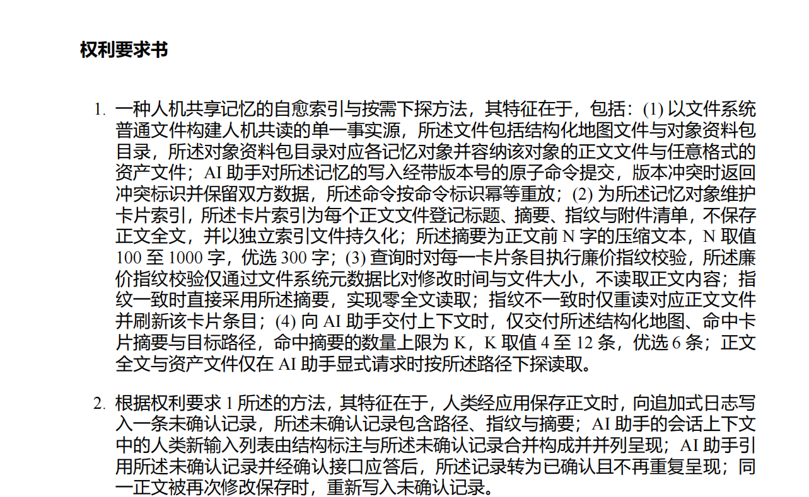
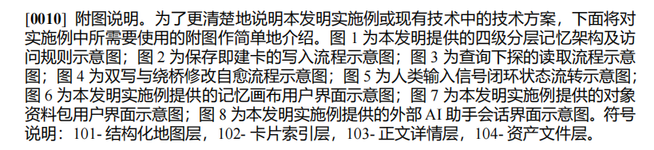

# 找茬

不是我找茬啊 
为啥我们的文字都是加粗
的 

人家没有加粗 并没有1：1模仿
我们的图片没有对方大 你能不能自己看看能不能修复

你自己看看人家小标题 多标准 这个间隔 

我们的小标题根本没有按照正确方法写

这个第4点我们确实有这个吗 要写进去吗
4.
根据权利要求 1 所述的方法，其特征在于，检索采用确定性图检索：以当前节点与
当前路线的一跳邻域优先，叠加未解决对象与待验证方案的优先级排序，并以关键
词检索对卡片摘要打分，召回结果附带可解释的召回理由。

我们这个附图说明 间隔都们没有 人怎么读取？

---

# 【全面找茬报告｜2026-08-23】

## 先说结论

这不是“差一点”，而是当前成稿的**文件体例、字体、页眉页脚、标题层级、行距、附图规范**都没有按对标件落实。对标件的技术内容不能照抄，但它的阅读节奏与排版骨架可以、也应该尽量复刻。

本次已经渲染逐页查看：
- 当前稿：`docs/patent-tex/main.pdf`，9 页；
- 对标件：`docs/patent-tex/template-patent-1.pdf`，16 页（授权公告版）。
- 注意：对标件第 1 页的公告号、申请号、分类号、申请人、审查信息等是**授权公告特有内容**，不能复制进申请文件；以下问题只对照可借鉴的正文、权利要求与附图版式。

## 一、已经坐实的排版问题

### P0-1 正文字体错了：当前是微软雅黑，不是对标件的宋体

- **现状**：`main.tex` 中写的是 `\\setCJKmainfont{Microsoft YaHei}`。PDF 内嵌字体也证实：当前正文为 Microsoft YaHei；对标件正文为 SimSun（宋体）。
- **直观后果**：微软雅黑字面大、笔画粗、横竖更满；即便没有 `\\textbf`，整页仍像“全加粗”。这就是你看到“我们的文字都是加粗”的直接原因。
- **对标做法**：正文宋体；发明名称和一级章节标题才用黑体加粗。
- **应改**：正文统一改为 SimSun；仅保留必要标题为 SimHei 加粗。不能把“全部看起来粗”当作排版风格。

### P0-2 当前实际没有 1.5 倍行距

- **现状**：源码只设置了 `\\parskip=0.5em`，没有 `\\linespread` / `setspace` / `\\setstretch`。因此正文仍是 LaTeX 默认单倍基线。
- **对标做法**：正文行距明显更舒展；段与段的区分靠标题段距、首行缩进和行距，不是简单塞一个空白段。
- **后果**：当前说明书第 4–6 页出现“横向很满、纵向很挤”的灰块；字虽大，扫读更累。
- **应改**：改为宋体小四（12pt）+ 1.5 倍行距；正文段前后为 0；章节标题单独控制段前/段后，不能用全局 `parskip` 代替。

### P0-3 没有四节独立页眉、页脚和重起页码

- **现状**：当前“说明书摘要 / 权利要求书 / 说明书 / 说明书附图”都是正文左上角的粗体字；没有居中页眉横线；页码从整份 PDF 连续为 2–9。
- **对标做法**：权利要求书、说明书、附图均为**居中页眉 + 下横线**；页眉与正文分离。申请文件应按四节处理，权利要求书、说明书页码各自从 1 开始（最终以正式申请模板实测为准）。
- **后果**：当前看起来像一篇普通技术报告，不像规范申请文件。
- **应改**：采用四个 next-page 分节，四节独立页眉；权利要求书和说明书各自从 1 起页码。不能只把“权 利 要 求 书”加粗放在正文首行。

### P0-4 页面边距没有按申请文件常用版心落位

- **现状**：`geometry` 把四边都设为 2.4cm。
- **参考规则**：常用申请文件版心为上/下约 2.5cm、左约 3.2cm、右约 2.5cm（最终要以可用申请模板实测为准）。
- **后果**：当前正文从左边界开始得太早，阅读重心偏左，也没有形成对标件那种稳定的文本栏。
- **应改**：不要继续“四边一样”；按申请文件模板的左右版心校正。

## 二、标题与段落层级：你指出得完全对

### P1-1 小标题写法不对：被写进了段号正文

- **现状**：例如 `[0001] 技术领域。本发明……`、`[0002] 背景技术。随着……`、`[0009] 有益效果。与现有技术相比……`、`[0010] 附图说明。为了……`。
- **对标做法**：技术领域、背景技术、发明内容、附图说明、具体实施方式是**独立左对齐标题**，黑体/加粗、字号高于正文，且上下有稳定间隔；段号从标题下的正文开始。
- **后果**：当前读者无法一眼识别说明书的五大部分，标题和正文混在一起，层级丢失。
- **应改**：标题独立成段；标题后另起 `[0001]` 正文。不能继续用“段号 + 标题 + 正文”挤在同一行。

### P1-2 段号不应单独加粗

- **现状**：`\\paragraphno` 将 `[0001]` 等段号包在 `\\textbf{}` 中。
- **对标效果**：对标件段号和正文同属一套宋体阅读节奏，不会出现当前这种“黑色粗钉子”般的段号。
- **应改**：段号宋体常规字重，与正文保持一致；用固定的编号宽度、首行缩进和悬挂布局建立秩序，而不是加粗。

### P1-3 段落组织太长、太像报告，不像可扫读的专利说明书

- **现状**：当前 `[0003]`、`[0006]`、`[0012]–[0020]` 多段承担多个技术点，一段铺满大半页。
- **对标做法**：每个编号只承担一个明确技术点；实施例的步骤、条件、模块和效果分开写，读者可以凭段号定位。
- **应改**：不是机械加页数，而是按“一个段号 = 一个可定位技术点”拆分。对标件说明书为 10 页、段号到 [0123]；当前仅 3 页、到 [0020]，这本身不等于不合格，但现在的解释密度明显偏薄、定位性偏弱。

## 三、权利要求书：第 4 项有真实实现，但排法仍不对

### P1-4 你问的“第 4 点”确实有，而且有代码与产品证据

结论：**应保留，不是凭空写进去的。**

- 当前权利要求 4 已原样写在 `sections/03-claims.tex`。
- 说明书 `[0015]` 已给出同一检索过程的实施例支撑。
- 实现侧已核实：`src/shared/index.ts` 的 `retrieveContext` 明确实现了：
  1. 当前节点/命中对象作为种子；
  2. 一跳邻居加分；
  3. 同一路线、两跳对象的优先级；
  4. 未解决 problem、待验证方案的优先级；
  5. Markdown 的 BM25 评分；
  6. 返回可解释的 `reasons`（例如“明确目标的一跳邻居”“待验证方案”“Markdown BM25 命中”）。
- **建议改写而非删除**：把“关键词检索”明确为“基于摘要字段的 BM25 检索”或上位概念“基于关键词的文本相关性检索”，并确保权利要求、说明书和实际实现术语完全一致。

### P1-5 权利要求 1 的四步没有按可读单位分开

- **现状**：当前第 1 项把 (1)–(4) 连在一个列表项内；第 2–7 项也各是一大段。整个权利要求书被压进 1 页。
- **对标做法**：独立权利要求中的每个分号分句/步骤另起行并有稳定缩进；从属项也保留呼吸空间。对标件权利要求书为 3 页，不是为了凑页数，而是因为每个限定被清楚拆开。
- **应改**：权利要求编号顶格；“其特征在于”后，各技术特征按分号分句独立排版并统一悬挂缩进；控制每行长度，避免整页像合同条款。

## 四、附图：这是当前和对标件差距最大的地方

### P0-5 专利附图不应使用彩色流程图

- **现状**：图 1–5 使用蓝、绿、黄、橙、红色填充；图 5 还有红色回流箭头。
- **对标做法**：纯黑白线条、黑字、白底；框线、箭头和引出线有清楚层级。
- **后果**：当前更像产品 PPT，不像专利附图；打印、扫描和黑白提交时信息层级会坍塌。
- **应改**：所有专利附图重画为黑白线图。颜色不能再承担含义；用编号、线型、位置和文字表达结构。

### P0-6 图片确实太小，根因已定位

- **现状**：图 6–8 被写成 `width=0.82\\textwidth`；第 9 页又在同一页容纳图 7 与图 8。截图自身还带有大块白边，实际界面内容只占页面很小一部分。
- **对标做法**：每张附图独占一页，图形尽量占满版心，核心文字放大到打印后可读；图号在图内或图下只保留简洁的“图 1”。
- **应改**：每张图单页；先裁掉无信息白边，再按版心宽度放大；截图如保留，必须让产品界面文字在 A4 打印后仍能读清。当前图 7、图 8不能通过这个标准。

### P1-6 当前附图说明被压成一整段，正是你说的“人怎么读”

- **现状**：`[0010]` 内连写“图 1 为……；图 2 为……；……图 8 为……。符号说明……”，没有逐图独立行，也没有符号说明的独立区块。
- **对标做法**：先写固定引导句，再逐图一句一行；符号说明另起区块，采用“101—结构化地图层”这种可扫读格式。
- **应改**：保留引导句；图 1 至图 8 各自独立一行/段；“符号说明”单独列出。不要为了少一页把 8 张图说明压在一个段号中。

### P1-7 图注风格不该照普通论文

- **现状**：使用 `\\caption` 自动生成“图 1: 四级分层记忆架构及访问规则”等长图注；摘要图还附有“与说明书附图图 1 一致”的论文式说明。
- **对标做法**：附图页主要是图本身与简洁图号；图的解释在“附图说明”文字部分完成。
- **应改**：取消论文式长 caption；图内/图下只放“图 1”“图 2”；文字描述全部迁回附图说明。

## 五、还要改，但不要误模仿

1. **不要复制对标件页眉左侧的 “CN 116992005 B” 和 “1/10 页”**：那是授权公告版识别信息，不是申请稿格式。
2. **不要复制对标件第 1 页的公告、引证、分类号、代理机构信息**：它们属于公告版。
3. **不要为了追到 16 页硬灌水**：页数不是质量。要补的是实施例的可实施细节、步骤条件、异常分支、模块输入输出及逐图说明。
4. **不要照抄对标件的技术方案、模块名、实施例内容或图形结构**：只能学它的版式、层级、句式节奏和可读性。

## 六、建议按这个顺序修，不会返工

- [ ] 先重建四节页面骨架：页边距、页眉横线、页脚页码、分节重起页码。
- [ ] 统一字体：正文宋体；发明名称/章节标题黑体；去掉正文和段号的假加粗。
- [ ] 设定正文 1.5 倍行距；移除全局 `parskip=0.5em` 的“空白补救”。
- [ ] 把五个章节标题从段号正文中拆出来，并统一标题前后间隔。
- [ ] 重排权利要求：一项一块；独立项按技术特征逐行；再决定它自然占几页。
- [ ] 重写“附图说明”为逐图逐行 + 独立符号说明。
- [ ] 重画图 1–5 为黑白线图；图 6–8 逐张裁白、放大、单页。
- [ ] 重新编译后逐页渲染核验：页眉、页脚、标题、字体、图中文字、分页、单图单页全部肉眼检查。

## 本轮证据

- 渲染核对：当前稿 9 页；对标件 16 页；两者均为 A4。
- 字体核对：当前 PDF 内嵌 Microsoft YaHei / Microsoft YaHei Bold；对标件正文内嵌 SimSun，标题含 SimHei。
- 源码定位：`main.tex` 的微软雅黑设置、统一 2.4cm 页边距、全局 `parskip`；`03-claims.tex` 的权利要求第 4 项；`04-specification.tex` 的 [0010] 附图说明；`05-drawings.tex` 的彩色图、0.82 倍宽度和长 caption。
- 实现核对：`src/shared/index.ts` 的 `retrieveContext` 支撑权利要求 4 所述的一跳邻域、状态优先、文本相关性评分和可解释召回理由。

> 本节点只记录“找茬”和修复顺序；本轮没有改动专利源文件或 PDF。下一步应先做版式骨架，版式通过逐页目检后再改文字，避免文字与版式一起返工。
---

## 【本地专利排版环境核验｜2026-08-23】

### 已就绪

- XeLaTeX / MiKTeX、latexmk、xeCJK、TikZ、geometry、enumitem、setspace、fancyhdr 等 LaTeX 包已实际探测到。
- Windows 字体已具备：宋体（SimSun）、黑体（SimHei）、微软雅黑、Times New Roman、Courier New。
- PDF 工具已具备：pdftoppm、pdfinfo、pdffonts、pdftocairo、pdfimages。
- 新增 Graphviz（dot）与 ImageMagick（magick），可用于黑白专利附图自动布局、截图裁白与尺寸检查。
- 新建隔离 Python 环境：docs/patent-tex/.venv；其中已验证可导入 python-docx、matplotlib、Pillow、reportlab、pdfplumber、pypdf、graphviz、PyMuPDF。
- 本机已有 WPS，可用于后续 DOCX 模板人工预览。

### 实测

在不覆盖当前 main.pdf 的临时目录中，已运行 XeLaTeX 完整编译与 PDF 渲染：
- 编译退出码：0；
- 输出：A4、9 页；
- PDF 文字/字体检查与第 4 页 PNG 渲染均成功。

### 不需要再装的项

- 宋体、黑体、中文 LaTeX、TikZ、PDF 渲染链均不缺。
- LibreOffice 原本作为 DOCX 转 PDF 的备用工具尝试安装，但官方安装包连续无下载进度，已停止该可选下载；本机 WPS 已可承担 DOCX 预览。当前专利为 LaTeX → PDF，LibreOffice 不构成编译阻塞。

### 仍需留意

- MiKTeX 只提示“尚未检查更新”，不是缺包或编译失败；当前不在排版重构前升级，以免换版本造成新的版式漂移。
- 当前源码仍有已知 Overfull hbox（请求书表格约 8pt）以及版式问题；它们是文件内容/排版待修项，不是本地环境缺失。