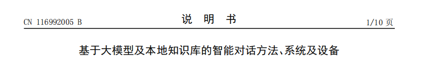

# 细节找茬

为啥空白这么多呀 不好 然后你擅自截了我的图片 不行 图6换成这张吧 "D:\桌面\截图\1 项目记忆.png" 然后我们页码也不对吧 应该是 从1到16吧 

然后它们这个上方小标题 下面是这个 专利的名字

我们这个不太对吧 感觉重复了  

## 【第三轮细节找茬｜2026-08-24】

### 本轮依据与当前状态
- 对当前 `main.pdf`、对标件和源码逐页/逐项复核；另以“完整产品图”校验版复核图 6--8。
- 用户已明确更正：**产品图不得裁切**；图 6 必须使用其指定的完整界面图。源码已据此改为完整图源，图 7、图 8 也恢复完整截图，仅转为灰度。由于 WPS 占用，常规 `main.pdf` 尚未被这次图源变更覆盖；校验版为 `main-uncropped.pdf`，A4、16 页、两次 XeLaTeX 编译成功。

### P0：必须先修
1. **页码不是连续 1--16。**
   - 证据：摘要、权利要求书、说明书、说明书附图各在节首重置页码；可见页脚反复从 1 开始。
   - 根因：`main.tex` 的 `patentsectionstart` 每次调用 `setcounter{page}{...}`。
   - 修改目标：按用户要求，整份 PDF 从请求书起连续编号 1--16；右上角可用“当前页/16 页”，底部不再出现分节重新从 1 开始的页码。

2. **页眉与正文文书名重复，且缺少横线下的发明名称。**
   - 当前权利要求书、说明书等页面：页眉已有“权利要求书/说明书”，横线下再次以大字重复相同文字。
   - 对标件的可借鉴骨架应是：横线以上居中文书类型；横线以下居中放本申请的发明名称；右侧放连续页码。不得复制对标件的公告号或任何身份信息。
   - 修改目标：移除正文中的重复“大文书名”，在其位置统一放本申请发明名称。

3. **图 6--8 单图单页且为横向界面，造成约半页以上无信息白区；这是“空白很多”的直接原因。**
   - 图 6、图 7、图 8 为横向界面，宽度先达到 A4 版心上限，高度自然只有约三分之一到一半页面；单图单页会留下大块空白。
   - 这不是把图裁切就能合理解决的问题；“完整截图、A4 纵向、单图单页、不拉伸”四项不能同时消除空白。
   - 建议的待定版式决策：保持完整、不裁切，图片以最大宽度放置并上下居中；若仍不接受空白，只能改为重新截取**更高缩放、但画面本身完整**的界面图，或允许同页放置两张辅助界面图。不得再擅自裁切。

4. **图 1 的“访问规则”中“显式路径读取”重复两次。**
   - 源码 `05-drawings.tex` 的规则框连续写了两行同样文字；没有对应两种不同规则。
   - 修改目标：删除重复项或改为实际不同的第四项规则，并同步摘要附图、图示文字与说明书。

### P1：可读性、公开风险和一致性问题
5. **当前完整图 6 本身仍不适合直接作 A4 细读图。**
   - 这是用户指定的完整图，已按原样保留；但节点文字在 A4 中小，部分节点在画面边缘不完整，长英文/文件名发生断行。
   - 正确补救不是裁切，而是从产品中以更高缩放重新截一张完整、干净的画布视图；若用户确认现图只承担“整体界面存在”的辅助作用，也可保留，但不能在文字中声称图内每个节点均清晰可读。

6. **图 7、图 8 包含不宜随专利公开的开发/对话杂项。**
   - 图 7 可见内部文件路径和参考专利文件名；图 8 可见原始助手对话、内部路径和操作性文字。
   - 这会把实施例从“界面/交互示意”变成“开发过程截图”，也可能引入与本申请无关的第三方资料线索。
   - 在“不裁切”前提下，建议重新制作干净的完整演示截图：不显示本地路径、参考专利、原始会话内容或无关按钮；不是在现有图上裁一块。

7. **权利要求首页、说明书首页的标题前空白过大，且视觉重心过低。**
   - 当前为“页眉+横线 → 大段空白 → 同名大标题 → 正文”；第 1 页权利要求书尤其明显。
   - 改为“页眉+横线 → 发明名称 → 适度段前距 → 正文/一级标题”，可同时消除重复与无意义空白。

8. **图 1--5 也存在“单小图占整页”的利用率问题。**
   - 黑白流程图本身清晰，但在 A4 纵向页面只占中上部，图号下方至页脚留白很大。
   - 与图 6--8 不同，图 1--5 可在不裁切的情况下放大、优化纵向布局或成组排版；应以图中文字在 A4 100% 下可读为验收条件。

9. **摘要附图仍有编译盒宽诊断。**
   - XeLaTeX 没有失败、逐页渲染无裁切；但摘要附图持续出现 24pt overfull 与一条 underfull 诊断。
   - 这不是提交前可忽略的“零问题”状态；应在页眉/标题重构时一起消除，再以无 overfull/underfull 的日志作为验收。

### P2：充分公开与提交前检查
10. **具体实施方式没有把关键实现名与参数依据充分落到可追踪的位置。**
    - [0020]--[0028] 已写出机制和 N/K 范围，但未列出关键实现模块、函数/数据字段的对应表；对“摘要长度、结果上限、记录上限”的选择依据也不足。
    - 建议新增一张不公开仓库 URL 的“实现要素—段落—权利要求”内部追踪表，并在实施例补足必要的字段/参数定义；避免只靠概念性叙述支撑较宽的权利要求。

11. **本轮不能把“图 6--8 已清晰可读”记为通过。**
    - 完整图源的要求已执行，但 A4 中图 6 的节点文字、图 7 的正文细节、图 8 的对话细节仍受屏幕截图比例限制。
    - 结论应诚实写为：图号、单图单页和灰度打印已可用；“界面内小字可读”待干净高清截图后再验收。

### 本轮建议的修复顺序
1. 先统一连续页码、页眉三栏和横线下发明名称，删除正文重复文书名；
2. 删除图 1 重复规则，消除摘要附图盒宽诊断；
3. 保持“不裁切”的用户边界，替换为三张干净、完整、高缩放的产品截图；
4. 再处理图 1--5 的放大/组版，最后逐页复验 1--16 页与图中文字可读性。
## 【自审复核｜2026-08-24】
- 已将完整图校验版覆盖为 main.pdf；两文件 SHA-256 一致，主 PDF 为 A4、16 页。
- 图 6 使用用户指定的完整图源；图 7、图 8 的灰度版像素尺寸与各自原图一致，未裁切。
- 自审复核：摘要为 299 字；编译日志无未定义引用、未定义控制序列或中止错误。
- 尚未通过的实质项不被掩盖：页脚仍为分节重置序列，未达到用户要求的连续 1--16；页眉/正文同名重复、图 1 规则重复、横向图单页留白和图 7--8 的开发杂项仍待后续按本节点 P0/P1 清单修改。
## 【已修复｜2026-08-24】文书名重复与发明名称缺失
- 摘要、权利要求书和说明书首个页面已改为：横线以上保留文书类型；横线以下显示本申请发明名称。原先重复的“说明书摘要 / 权利要求书 / 说明书”大标题已移除。
- 权利要求书首页的额外顶部空白已同步缩小。已渲染复核三页：发明名称单行完整显示，无断行、压线或标题重复。
- 已生成 main-title-fixed.pdf（A4、16 页、两次 XeLaTeX 编译成功）。尝试覆盖 main.pdf 时因该文件被外部程序占用而失败；main.pdf 仍为上一版，待占用释放后再覆盖。