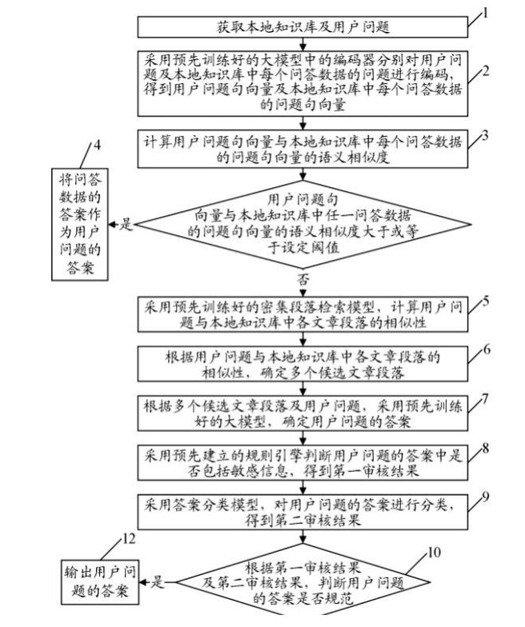
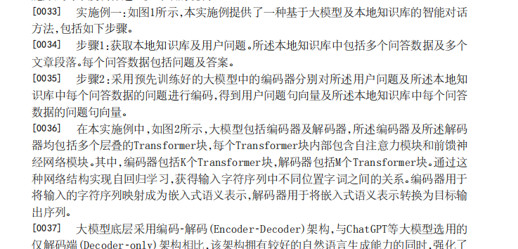
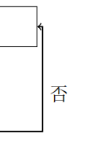
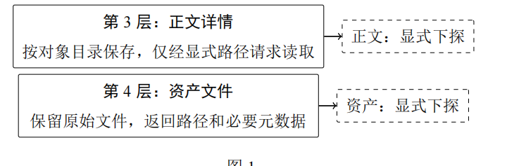

# 流程图模仿

我发现人家的流程图是这样的

每个步骤右上角 斜杠 12341567

配合文案 具体什么图片中 对应的 1 2 3 4 5 6 7 每一步都非常清楚

特别专业 我们的就是非常的拉跨 这些都没有

这个箭头长度又这么短 感觉上就是连期末作业都不如

摘要附图 正文 资产都是显式下探 是确实这样 还是怎么说？

整体上就是文案跟图片配合不够紧密 不够专业  
## 实施结果（2026-08-24）

### 实际修正

- 已重绘摘要附图及图 1—5：每个技术单元均从框体右上角以斜线引出附图标记；引线、分支箭头、框内文字和汇合点已分层布置，避免以汇合点替代技术步骤。
- 图 1 使用 101—108：101 结构化地图层、102 卡片索引层、103 正文详情层、104 资产文件层；105 结构投影、106 摘要检索、107 正文显式路径读取、108 资产元数据返回/显式受控读取。
- 图 2 使用 201—207：保存与原子替换、建卡、索引/附件刷新、人类保存判断、未确认记录处理、返回保存结果。
- 图 3 使用 301—307：接收请求、读取并比较修改时间与文件大小、新鲜度判断、摘要复用、失效正文局部刷新、排序并附召回理由、按需读取结果。
- 图 4 使用 401—409：外部修改、查询开始、索引可用性判断、按需重建、元数据比较、一致性判断、复用或单卡刷新、继续输出。
- 图 5 使用 501—505：人类保存、未确认记录、持续提示、确认判断、停止重复呈现。
- 图 6—8 未增加附图标记引线，保留原始界面截图，未作裁切。
- 摘要、附图说明和具体实施方式已同步按图号逐步解释上述标记；正文明确为显式路径读取，资产默认仅返回元数据，二进制资产只在显式受控请求时读取。未新增性能结论。

### 核验

- 使用 XeLaTeX 连续编译两次，得到 16 页 main.pdf；无未定义引用、无未定义命令，正式 PDF 已与最终候选文件哈希一致。
- 全部 16 页已重新渲染；重点逐图目视检查图 1—5 的编号可读、右上引线不压文字、箭头方向与是/否分支明确；图 6—8 截图完整。
- 源文件交叉检查确认 101—108、201—207、301—307、401—409、501—505 均同时出现在附图及说明书/摘要对应文字中。
- 已复跑索引、人类更新、项目存储三组自动化测试：26 通过、0 失败。
- 编译日志仍有本机 MiKTeX 版本/更新提示，以及摘要附图容器的既有盒宽提示；渲染检查未见截断、重叠或图形溢出。

### 修改文件

- docs/patent-tex/sections/02-abstract.tex
- docs/patent-tex/sections/04-specification.tex
- docs/patent-tex/sections/05-drawings.tex
- docs/patent-tex/main.pdf