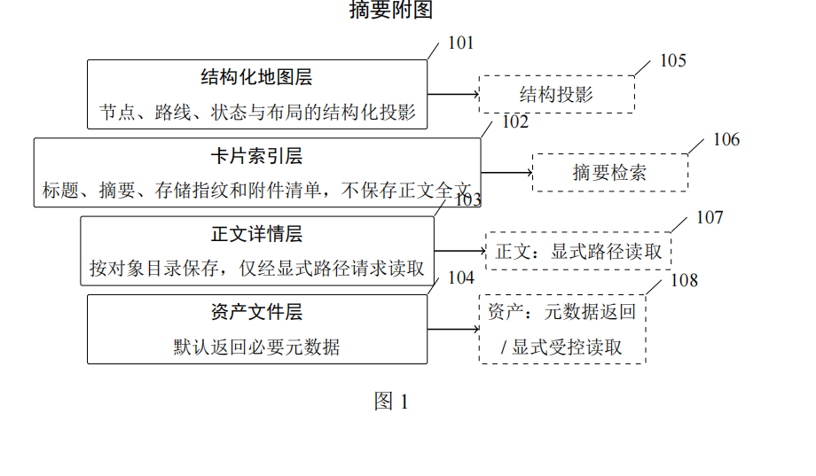
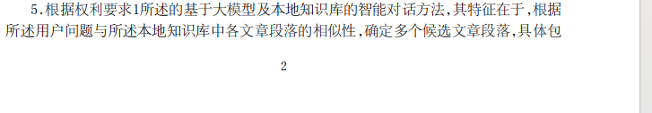
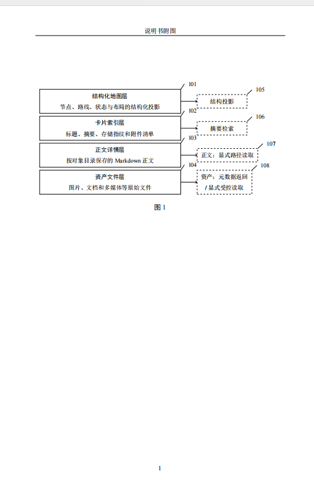
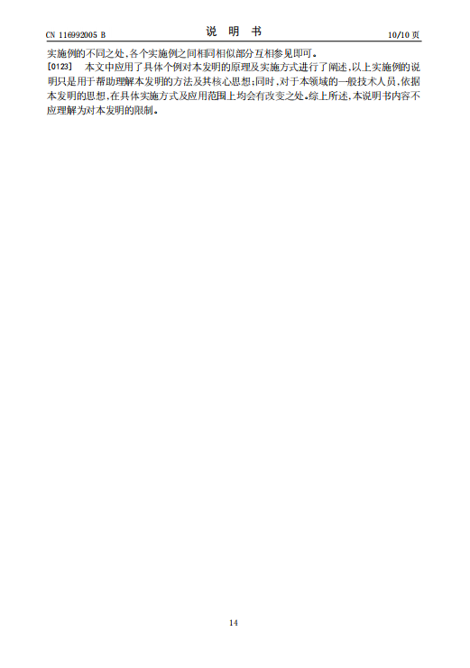

# 新节点23

这个摘要附图不应该有这个 图一的标识吧 明显跟后面重复了 

然后我看到 第二页附图 从页码1开始 这不对吧  还是就这样 我不了解

只是我看这个模板第二页就是2开始的

最后我看到的我这个页码从附图开始又从1开始重置了 这不对吧？

你看看人家都是接续的

## 审核结论（2026-08-24）

### 不应改动的两项

- 摘要附图中的“图 1”应保留。摘要附图必须从说明书附图中指定一幅；本案指定的是说明书附图的图 1，因此摘要处重复呈现同一张图和同一图号是正确做法，不是额外新增了一张无编号附图。
- 页码不应改成整份 PDF 从头到尾连续。说明书摘要、权利要求书、说明书、说明书附图属于分别编页的文件：摘要为 1 页；权利要求书为 1—2 页；说明书为 1—4 页；说明书附图为 1—8 页。请求书无该技术文件页脚页码。模板中看到的“2”是其所在文件的第二页，不能据此要求跨文件续号。

### 需要后续修正的两项

- 当前摘要附图承载 8 个标记及多行说明，按摘要附图需缩小至 4 厘米×6 厘米仍可辨认的要求判断，文字过密；应将说明书附图图 1 和摘要附图同步精简为可缩小阅读的同一张图，而不是删除“图 1”或另造一张不对应的图。
- 请求书/提交系统应明确指定“说明书附图中的图 1 为摘要附图”。当前本地请求书仅列出文件清单，未见该指定语句；提交前需在系统对应字段确认，若继续使用本地请求书作为申请文件则应补写。

### 依据

- 国家知识产权局《专利审查指南》要求：摘要附图应为说明书附图中的一幅，并在请求书中写明图号；各类文件的页码分别连续编写。
## 实施结果（2026-08-24）

- 已将图 1 重构为摘要与说明书附图共用的同一源文件：保留“图 1”，保留 101—108 标记，但将框内表述压缩为层名/访问规则，满足缩小后仍可辨认的要求；摘要附图与说明书附图中的图 1 经渲染核对一致。
- 已在请求书增加“摘要附图指定：指定说明书附图中的图 1 为摘要附图”，与摘要附图和说明书附图的图号一致。
- 保持各技术文件分别连续编页：摘要 1 页、权利要求书 1—2 页、说明书 1—4 页、说明书附图 1—8 页；未改成跨文件续号。
- 全部正式件已连续 XeLaTeX 编译两次并渲染 16 页；请求书无可见表格溢出，摘要严格计数 298 字，编译日志无未定义引用、控制序列错误或停止项，PDF 已嵌入 SimSun 与 SimHei。
- 已输出完整核对版及五份独立正式件；最终结论为文件本身无需再因本节点问题修改，可进入提交系统的人工作用域复核。