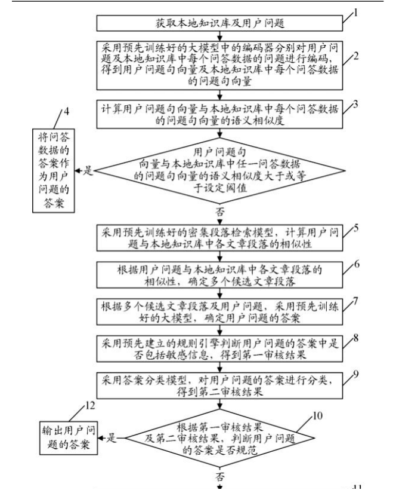
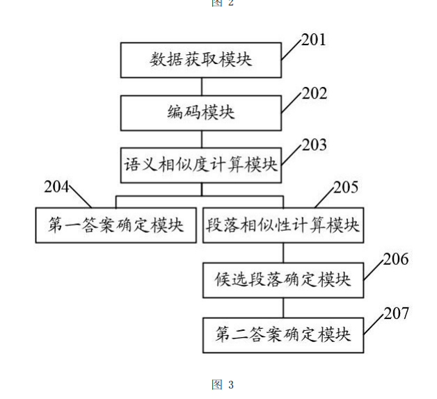

# 图示与说明不够紧密
我的产品图放在最后

具体实施方式
[0030] 下面将结合本发明实施例中的附图，对本发明实施例中的技术方案进行清楚、完
整地描述，显然，所描述的实施例仅仅是本发明一部分实施例，而不是全部的实施例。基于
本发明中的实施例，本领域普通技术人员在没有做出创造性劳动前提下所获得的所有其他
实施例，都属于本发明保护的范围。
[0031] 本发明的目的是提供一种基于大模型及本地知识库的智能对话方法、系统及设
备，将大模型技术与用户知识进行完美融合，解决现有智能问答技术交互能力不足，无法结
合用户文档和知识，难以准确理解用户意图等问题。
[0032] 为使本发明的上述目的、特征和优点能够更加明显易懂，下面结合附图和具体实
施方式对本发明作进一步详细的说明。
[0033] 实施例一：如图1所示，本实施例提供了一种基于大模型及本地知识库的智能对话
方法，包括如下步骤。
[0034] 步骤1：获取本地知识库及用户问题。所述本地知识库中包括多个问答数据及多个
文章段落。每个问答数据包括问题及答案。
[0035] 步骤2：采用预先训练好的大模型中的编码器分别对所述用户问题及所述本地知
识库中每个问答数据的问题进行编码，得到用户问题句向量及所述本地知识库中每个问答
数据的问题句向量。
[0036] 在本实施例中，如图2所示，大模型包括编码器及解码器，所述编码器及所述解码
器均包括多个层叠的Transformer块，每个Transformer块内部包含自注意力模块和前馈神
经网络模块。其中，编码器包括K个Transformer块，解码器包括M个Transformer块。通过这
种网络结构实现自回归学习，获得输入字符序列中不同位置字词之间的关系。编码器用于
将输入的字符序列映射成为嵌入式语义表示，解码器用于将嵌入式语义表示转换为目标输
出序列。
[0037] 大模型底层采用编码‑解码（Encoder‑Decoder）架构，与ChatGPT等大模型选用的
仅解码端（Decoder‑only）架构相比，该架构拥有较好的自然语言生成能力的同时，强化了
说　明　书 3/10 页
7
CN 116992005 B
7
自然语言理解的任务能力，更擅长理解用户需求。
[0038] 步骤2的核心思想是将整个句子映射到向量空间，语义上相似的句子会被映射到
空间距离更为接近的位置。本发明采用基于大模型的句向量编码技术，通过训练好的大模
型将句子文本转化为一个固定维度的向量。
[0039] 具体地，将问题的句子转化为词元，并输入到训练好的大模型中，大模型的编码器
输出的嵌入式语义表示作为对应问题的句向量。再将所有问题的句向量存入向量数据库
中，并构建索引用于后续检索。从而实现对句子语义的理解和表示。例如，句子“今天是个好
日 子”可 表 示 为 一 个 跟 大 模 型 编 码 器 输 出 相 同 维 度 的 句 向 量 ：( ‑ 0 .1 3 2 9 0 4 1 ，
0 .16528024，……，‑0 .03694873，0 .42119873)。
[0040] 相比于传统的词袋模型和TF‑IDF等方法，基于大模型的句向量技术具有更高的准
确性和鲁棒性，可以更好地捕捉句子中的语义信息。此外，由于大模型是预先训练得到的，
因此可以大大减少句向量的生成时间和计算成本。
[0041] 进一步地，所述大模型的训练过程包括如下步骤。
[0042] （1）获取训练数据集。所述训练数据集中包括多个字符序列。
[0043] 具体地，训练数据集包括中文、英文与代码三部分，主要由文本篇章组成，训练数
据的最小单元为词元（Tokens）。训练数据集共含约4000亿个词元。其中，中文数据约1900亿
个词元，主要来自于微信公众号、知乎、百度百科、微博等；英文数据约1900亿个词元，主要
来自于互联网网页数据、图书、论文、维基百科等；代码数据约200亿个词元，主要来源于
GitHub等网站。采用公开渠道采集和付费购买等方式获得。获取的数据需要进行精细化去
重和清洗预处理，才能加入到训练数据集中。
[0044] （2）采用所述训练数据集对大模型进行迭代训练，以得到初步大模型。
[0045] 预训练阶段采用大规模、高质量的无标注文本语料对大模型的参数进行训练。首
先，采用标准的语言模型训练方法，使用自左到右的顺序输入字符序列对大模型进行预训
练 ，即 给 定 前 面 k 个 T o k e n ，对 第 i 个 T o k e n 进 行 预 测 ，具 体 的 目 标 函 数 为 ：
；其中， 为目标函数值，ui为输入的
字符序列中的第i个Token，k为上下文窗口大小， 为模型参数，P( )为概率函数。
[0046] 然后，基于目标函数，分批次输入训练数据集中的字符序列，对大模型的参数进行
更新迭代，使得大模型获得训练数据集中语言信息的概率分布。通过自监督学习的方式使
大模型获得蕴含在训练数据集中的基本知识、语言表达、逻辑推理等能力。
[0047] （3）获取指令精调数据集。所述指令精调数据集中包括多个真实对话数据。每个真
实对话数据包括知识信息、问题及答案。
[0048] 具体地，首先获取源数据：收集整理大量初步真实对话数据，初步真实对话数据包
括对话内容、参与者角色和发送时间等信息。
[0049] 然后构建指令模板：根据任务目标，设计用于训练大模型的基于知识中相关内容
回答用户问题的指令模板，其包含必要的问题、知识信息和答案。指令模板的形式如下。
[0050] {根据下面提供的知识回答问题。
[0051] 知识：****。
说　明　书 4/10 页
8
CN 116992005 B
8
[0052] 问题：****。
[0053] 答案：****}。
[0054] 再根据指令模板及源数据生成指令精调数据集。筛选源数据对话内容，从中抽取
出问答对，以及相关的知识信息。将其放入指令模板中，构建完整的指令精调数据。举例如
下。
[0055] {根据下面提供的知识回答问题。
[0056] 知识信息：《建筑施工企业主要负责人、项目负责人和专职安全生产管理人员安全
生产管理规定实施意见》（建质〔2015〕206号）规定，企业主要负责人包括法定代表人、总经
理（总裁）、分管安全生产的副总经理（副总裁）、分管生产经营的副总经理（副总裁）、技术负
责人、安全总监等。目前审查要求企业法定代表人、总经理以及技术负责人须具有安全生产
考核合格证书，如有变动请留意最新通知。
[0057] 问题：建筑公司申请安全证需要谁来担任主要负责人？
[0058] 答案：法定代表人、总经理（总裁）、分管安全生产的副总经理（副总裁）、分管生产
经营的副总经理（副总裁）、技术负责人、安全总监等}。
[0059] （4）采用所述指令精调数据集，对所述初步大模型进行迭代训练，以得到训练好的
大模型。
[0060] 具体地，采用有监督方式对初步大模型的参数进行微调，数据的指令、知识信息和
问题部分作为初步大模型的输入，答案部分作为初步大模型的输出。将指令精调数据集划
分为训练集和测试集。训练集用于初步大模型的精调训练，测试集用于评估初步大模型的
性能。
[0061] 上述步骤（1）和步骤（2）构建的初步大模型获得了基本的语言理解和表达能力，步
骤（3）和步骤（4）的目的是通过构造具体任务指令数据对初步大模型进行进一步的有监督
微调，使初步大模型获得解决实际任务的能力。例如分类任务、写作任务和问答任务等。本
发明中任务为基于本地知识库回答用户问题，主要特征是基于知识的对话生成任务。对初
步大模型的参数进行有监督微调，使初步大模型能够更好地拟合任务数据的特征，以更好
的与人类行为对齐。
[0062] 步骤3：计算所述用户问题句向量与本地知识库中每个问答数据的问题句向量的
语义相似度。
[0063] 具体地，所述语义相似度为余弦相似度或欧几里得距离。即采用余弦相似度或欧
几里得距离的向量相似度计算算法，比较用户问题句向量与本地知识库中的所有问题句向
量之间的语义相似度。
[0064] 步骤4：若所述用户问题句向量与本地知识库中任一问答数据的问题句向量的语
义相似度大于或等于设定阈值，则将所述问答数据的答案作为所述用户问题的答案。
[0065] 步骤5：若所述用户问题句向量与本地知识库中所有问答数据的问题句向量的语
义相似度均小于设定阈值，则采用预先训练好的密集段落检索模型，计算所述用户问题与
所述本地知识库中各文章段落的相似性。
[0066] 密集段落检索（Dense Passage Retrieval，DPR）模型是一个用于开放域问答

来来来自己看看 它们是怎么写的 写专利 图式标注和这个语言要紧密的结合在一起呀 

而我们的只是这样抽象的  图示说明 具体实施方式
[0020] 如图 1 所示，本实施例以 101 和对象资料包构成业务事实源，并由 102 保存
可重建的派生卡片。105 从 101 输出结构投影，106 在 102 的摘要上执行检索；103
的正文仅经 107 所示的显式路径请求读取。104 保留原始资产文件，108 默认返回
文件名、媒体类型、大小和更新时间等必要元数据，二进制资产不自动进入上下
文，仅在显式受控请求时由具备相应能力的调用方读取。在一实现中，卡片索引由
src/bridge/md-index.mjs 中的 MdIndex 管理。预写日志、备份和隔离文件用于恢
复与审计，不作为供人机协作编辑的业务正文。
[0021] 如图 2 所示，201 接收保存请求并原子替换正文；202 读取保存后的正文，抽
取标题和前 N 个字符作为摘要，并生成内容摘要值、修改时间和文件大小组成的存
储指纹，其中 N 取 100 至 1000，优选为 300；203 将卡片和附件清单原子写入索引。
MdIndex 的 refreshPathAndPersist 用于按保存路径刷新受影响卡片。204 判断该
保存是否由人类经本系统应用发起；为“是”时执行 205，追加包含路径、存储指纹、
摘要和时间戳的未确认记录；为“否”时执行 206；随后由 207 返回保存结果和版本
标记。文件改名、归档恢复、附件增删和对象创建后，可以刷新受影响对象的卡片。

人家的都是环环相扣 跟根据具体的实施例子 步骤1 步骤2 这样 进一步 逻辑环环相扣 我们的 连我自己都读不懂 

 人家围绕这个流程图非常的能够讲清楚事情 都是环环相扣的

在符号说明上才用上这个201 202 这样的写法

标记这些不是大问题 主要你语言要有逻辑性跟这个业务完全打通 重点是把事情说清楚 你自己想想怎么改吧1
---

## 已批准实施计划（2026-08-24）

### 审核结论

当前具体实施方式的问题成立：现稿把完整业务压缩为附图标记对应动作，缺少输入、处理依据、分支条件、输出和下一步，且图 1—5 尚未串成“应用保存—建卡—查询—新鲜度校验—输出理由—显式读取—人类确认”的连续实施例。地图命令写入、版本冲突和 WAL 属于独立权利要求的核心特征，须新增技术附图。同步纠正两项实现边界：过期版本只有在触达字段重叠时返回冲突，非重叠字段可基于当前版本重放；未确认记录字段采用实际落盘的路径、内容版本标记、修改时间、正文片段和记录时间。

### 实施范围

1. 保留 [0001]—[0019] 主体结构，新增图 9 的附图说明；将具体实施方式重写为 [0021]—[0064] 的连续实施例。
2. [0021]—[0024] 解释结构化地图、对象资料包、卡片索引、正文和资产，对应图 1。
3. [0025]—[0031] 逐步说明应用内保存、原子替换、卡片生成、附件刷新、人类来源判断和结果返回，对应图 2。
4. [0032]—[0040] 逐步说明请求参数、结构投影、索引装载、修改时间/大小校验、局部刷新、对象排序、BM25 摘要检索、召回理由、结果上限及显式路径读取，对应图 3。
5. [0041]—[0046] 用外部编辑器修改一个正文的完整实施例说明索引重建、逐卡校验、单文件刷新和继续检索，对应图 4。
6. [0047]—[0052] 说明同一路径最新未确认状态、持续呈现、确认、再次保存后重新出现及损坏日志行跳过，对应图 5。
7. [0053]—[0061] 说明命令标识、字段触达范围、非重叠重放、重叠冲突、WAL prepare、原子替换、commit、幂等返回和启动恢复，对应新增图 9。
8. [0062]—[0064] 以图 6—8 串联实际界面操作，并保留 500 对象测试和可配置变体。
9. 同步修订权利要求 1、2、5、6、7，使冲突、未确认记录、WAL、幂等和系统模块与实现、图 9 和说明书一致；摘要、发明名称及其余权利要求不扩写。
10. 新增图 9“地图命令版本冲突判定与持久化流程”，使用 901—911；图 1—8 编号及业务含义保持，图 6—8 保持未裁切，图 1 保持当前放大尺寸。

### 验收要求

复跑卡片索引、上下文收集、工具服务、人类更新、Markdown 冲突、命令 envelope 和项目存储测试；连续编译两次完整稿及五份拆分件并更新请求书页数；渲染全部 PDF 页面逐图核查；建立“图号/标记—业务步骤—说明书段号—权利要求—实现/测试”追踪记录。所有重要文案、逻辑与最终审核由主代理完成，子代理仅可承担边界清晰的自动测试或统计任务。
---

## 执行变更说明（追加，2026-08-24）

本节只记录实施期间用户新增的图序要求，不回改上方原话和已批准计划：

- 地图命令流程图由原计划的图 9 前移并重编号为图 6，附图标记由 901—911 同步改为 601—611。
- 三张产品界面图顺延为图 7、图 8、图 9，连续置于全部技术流程图之后；原图内容保持未裁切。
- 附图说明、具体实施方式和图中编号均按新顺序同步，旧编号 901—911 已无残留。

## 实施结果（2026-08-24）

### 一、实际修改

1. docs/patent-tex/sections/03-claims.tex
   - 修订权利要求 1、2、5、6、7。
   - 过期基线不再笼统写成一律冲突：非重叠字段基于当前版本重放，重叠字段返回冲突路径、当前已提交数据和待写入数据。
   - 未确认记录字段改为实际落盘的路径、内容版本标记、修改时间、正文片段和记录时间。
   - 补足命令标识复用校验、幂等返回、WAL 准备记录、原子替换、提交记录和启动恢复。

2. docs/patent-tex/sections/04-specification.tex
   - 保留 [0001]—[0019]，增加图 6 的附图说明 [0017]，并将产品图说明顺延到 [0018]—[0020]。
   - 将具体实施方式重写为 [0021]—[0064]，形成“文件事实源—应用内保存—建卡—上下文查询—新鲜度校验—局部刷新—召回理由—显式读取—人类确认—地图命令持久化—界面实施例”的连续业务。
   - 正文不再用附图编号代替叙述，而是逐段写明输入、处理依据、是/否分支、输出和下一步。
   - 实现边界与 src/bridge/ 中的 md-index.mjs、tool-service.mjs、human-md-updates.mjs 和 project-store.mjs 对齐。

3. docs/patent-tex/sections/05-drawings.tex
   - 新增并前置图 6“地图命令版本冲突判定与持久化流程”，使用 601—611。
   - 图 6 主链为：接收命令包 → 校验命令标识及请求摘要 → 幂等判断 → 字段触达范围 → 重叠冲突判断 → 应用并校验 → WAL prepare → 原子替换 → commit 和新版本。
   - 图 7—9 为三张未裁切产品界面图，连续放在技术流程图之后。

4. docs/patent-tex/sections/02-abstract.tex
   - 最终合规审核时将首句改为完整发明名称并明确技术领域；全文 297 字，未增加宣传性效果。

5. docs/patent-tex/sections/01-request.tex
   - 请求书表格取消 24pt 段首溢出。
   - 文件页数更新为：请求书 1 页、摘要 1 页、权利要求书 3 页、说明书 8 页、说明书附图 9 页。
   - 费用减缴备案序列号保持为 202600777444。

### 二、图文—权利要求—实现/测试追踪表

| 图号/标记 | 业务步骤 | 说明书段号 | 对应权利要求 | 实现/测试证据 |
|---|---|---|---|---|
| 图 1，101—108 | 四层文件事实及受控读取边界 | [0021]—[0024] | 权 1(1)(3)(5)、权 3、权 6 | md-index、tool-service；卡片索引/上下文测试 |
| 图 2，201—207 | 应用保存、原子替换、建卡及人类来源判断 | [0025]—[0031] | 权 1(3)、权 2、权 7 | Markdown 冲突、卡片刷新、人类更新测试 |
| 图 3，301—307 | 请求、元数据校验、局部刷新、排序理由和显式读取 | [0032]—[0040] | 权 1(4)(5)、权 3、权 4、权 6 | 上下文收集、BM25、工具服务测试 |
| 图 4，401—409 | 外部编辑后的索引重建或单文件刷新 | [0041]—[0046] | 权 1(4)、权 6 | 500 对象和单文件失效刷新测试 |
| 图 5，501—505 | 未确认记录、持续呈现、确认和再次出现 | [0047]—[0052] | 权 2、权 7 | human-md-updates 重放/确认/损坏行测试 |
| 图 6，601—611 | 字段冲突判定、幂等、WAL 和原子提交 | [0053]—[0061] | 权 1(2)、权 5、权 6 | envelope-v2、project-store 冲突/恢复测试 |
| 图 7—9 | 画布、资料包和助手的一次界面实施例 | [0062] | 实施例辅助，不额外扩大权利要求 | 现有产品界面，三图未裁切 |

### 三、验证结果

- 自动化测试覆盖卡片索引、上下文收集、工具服务、人类更新、Markdown 冲突、命令 envelope 和 ProjectStore。
- 结果：75 项中 73 通过、0 失败、2 跳过。两个跳过均因 Windows 当前权限不允许创建符号链接（EPERM），不是业务断言失败。
- 已实际证明：500 对象第二次收集正文读取为 0、外部改一个正文只重读该文件；非重叠命令基于当前版本重放；重叠字段返回冲突；相同命令幂等；WAL prepare/commit 及中断恢复；同一路径确认后再次保存会重新出现；损坏日志行被跳过。
- 完整稿在最终状态连续编译两次，均为 22 页、0 个 Overfull/Underfull/未定义引用警告。
- 五份正式件均连续编译两次，页数为 1 / 1 / 3 / 8 / 9，全部为 A4。
- PDF 字体核验：中文正文嵌入 SimSun，标题嵌入 SimHei。
- 最终 22 页全部重新渲染核验：图 1—6 先呈现技术结构与流程，图 7—9 连续置后；601—611 可读，引线不压文字，分支方向正确；图 7—9 未裁切；[0064] 已收回说明书第 8 页，不再单独形成空白页。

### 四、依据国知局指南的最终审核

- 依据 2026 年已施行的[国家知识产权局第 84 号令](https://www.cnipa.gov.cn/art/2025/11/13/art_74_202560.html)及国知局公开的[《专利审查指南》](https://www.cnipa.gov.cn/module/download/downfile.jsp?classid=0&filename=da9d262dfdfa4b9d82910c98cc3b7cbd.pdf&showname=%E4%B8%93%E5%88%A9%E5%AE%A1%E6%9F%A5%E6%8C%87%E5%8D%97.pdf)复核清楚、完整、能够实现、权利要求得到说明书支持、附图标记一致及摘要要求。
- 当前文件把文件系统状态、元数据校验、局部正文读取、字段重叠冲突和 WAL 恢复写成具体技术手段，并由实施例、附图和测试共同支撑；未使用“近乎常数”等未经证明的性能结论。
- 结论：本轮未发现仍需修改的文件级阻断项，当前五份正式件可进入提交。提交系统中仍须由申请人逐项复核姓名、证件号码、地址、联系方式、费减备案序列号及官方请求书字段；该人工复核不改变说明书、权利要求书和附图内容。

### 五、交付文件

- docs/patent-tex/main.pdf
- docs/patent-tex/提交件/00-完整核对版.pdf
- docs/patent-tex/提交件/01-发明专利请求书.pdf
- docs/patent-tex/提交件/02-说明书摘要.pdf
- docs/patent-tex/提交件/03-权利要求书.pdf
- docs/patent-tex/提交件/04-说明书.pdf
- docs/patent-tex/提交件/05-说明书附图.pdf

未通过项：无。剩余事项仅为提交系统内的个人信息和官方表单字段人工复核。