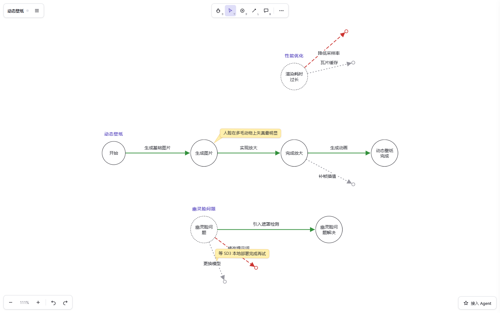
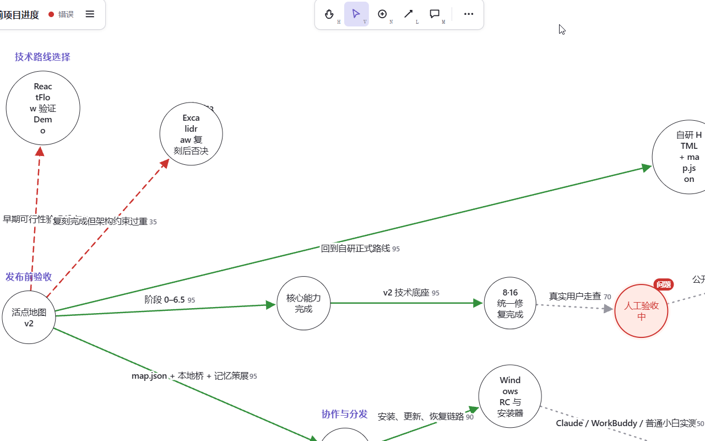

# Live Dot Map / 活点地图

让人和 Agent 在同一张地图上探索未知。

A shared exploration space for humans and agents.



**[⬇ Download (Windows)](https://github.com/hhh-dahah/live-dot-map/releases/download/v2.0.0/LiveDotMapSetup.exe)** · **[Demo](https://livedotmap.top)** · **[Documentation](agent-kit/setup.md)**

## Why?

Chat is linear. Exploration is not.

对话是线性的，但探索不是。一个未知问题很少只有一条路，活点地图把每次尝试、每个判断留在一张图上，而不是埋进聊天记录：

```text
未知问题
├── 方案 A → 失败
├── 方案 B → 待验证
└── 方案 C
    ├── C1 → 失败
    └── C2 → 成功
```

失败的路线不会被删掉，它们是下一次判断的依据；Agent 和人读的是同一张图。

## 产品 Demo

在线体验：<https://livedotmap.top>（落地页与在线画布可直接浏览；真实体验需本地安装，并接入你自己的 Agent）。



## 核心特性

- **项目记忆可视化** — Agent 和您都可以把项目的目标、尝试和结论画在一张地图上，不用翻聊天记录就能看清进展。
- **极度节省上下文** — 节点记概要，后端包记详细信息；Agent 智能索引，智慧又省钱，麻麻再也不用担心我的钱包啦。
- **不同任务整合思考，一键切换打通记忆** — 切换不同记忆地图，Agent 自动读取多任务历史，实现跨项目联合推理，不用重新输入另一任务信息。
- **全新对话，也能调取过往思考细节** — 开启全新对话时，Agent 可以定位到指定记忆节点，快速调取当时的判断、方案与结论，不用从头回忆历史。
- **人机共用画布，双向同步思考进度** — 你在地图上做的标注、修改，Agent 实时感知；Agent 产出的思考也自动回写到地图，人与 AI 同步推进思路。

## 安装方式

**普通用户（Windows）**：下载 **[LiveDotMapSetup.exe](https://github.com/hhh-dahah/live-dot-map/releases/download/v2.0.0/LiveDotMapSetup.exe)**（或到 [Releases](../../releases) 选择最新版本），安装后双击桌面图标直达画布，选择一个项目文件夹即可开始。然后在你自己的 Agent（Codex / Claude Code / Kimi Code 等）里打开这个项目文件夹，对它说一句 `/地图自检`，即可完成接入与健康检查——画布本身不含 Agent，协作发生在你信任的 Agent 与本地桥之间。

**开发者**（需要 Node.js ≥ 20.12）：

```powershell
git clone https://github.com/hhh-dahah/live-dot-map.git
cd live-dot-map
npm ci          # 安装依赖（根目录，含精确锁版本）
npm run build   # 构建核心、画布 app.html 与本地桥
npm test        # 113 项单元与闭环测试
```

构建后用浏览器打开根目录的 `app.html` 即是画布；落地页开发见 `landing/`（`cd landing && npm ci && npm run dev`）。全量验收（含三浏览器与安装器检查）执行 `npm run verify`。

## 文件结构 / Agent 如何读取

项目 = 一个文件夹，地图 = 一个任务的记忆。所有数据留在项目目录，人和 Agent 读写同一份文件：

```text
项目目录/
└── .live-dot-map/
    ├── maps/<id>/map.json   # 每张地图的结构（一项目多地图）
    ├── nodes/ routes/       # 节点与路线的 Markdown 详情
    └── active-map           # 当前地图指针
```

- Agent 通过本地桥（可靠保存、WAL 恢复、冲突检测、SSE 实时同步、确定性图检索与 MCP 工具）读写地图。
- 内置 Codex、Claude Code、Kimi Code 适配器（[`agent-kit/`](agent-kit/)），接入协议见 [`agent-kit/setup.md`](agent-kit/setup.md)。
- 数据不出本机，不上传项目内容。

仓库结构：

- `app.html` — 正式画布（单一事实源）；`canvas.html` 是冻结的验收样板。
- `src/bridge/` — 本地桥（Node）：存储、同步、MCP。
- `agent-kit/` — 各 Agent CLI 的项目适配器与接入文档。
- `landing/` — 落地页源码（Next.js 静态导出）。
- `installer/` — Windows 安装器（WinForms）。
- `docs/` — PRD、实测记录、执行计划与交接摘要。

## 当前状态

Alpha：Windows 版可下载使用，核心链路（画布、本地桥、多地图、人机协同）已可用，正在做各 Agent 平台的真实生命周期验收。界面与协议可能随迭代调整。

## Roadmap

- 各 Agent 平台（Claude Code、Kimi Code、WorkBuddy 等）全生命周期验收
- 安装与首用体验持续打磨
- 更细的路线图见 [Issues](../../issues)，欢迎直接提需求

## License

[Apache-2.0](LICENSE)。界面文案与文档使用简体中文。
