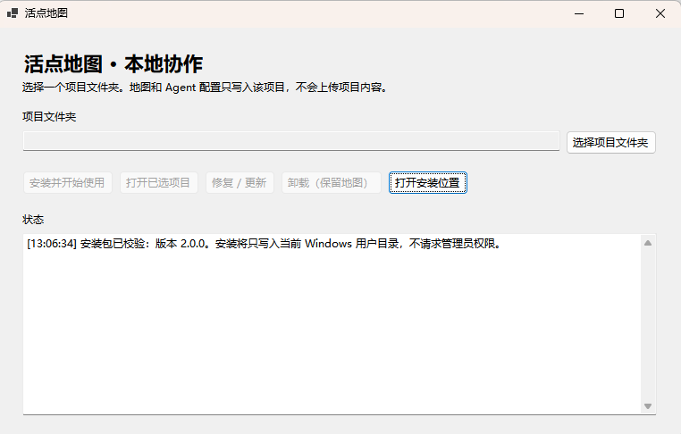
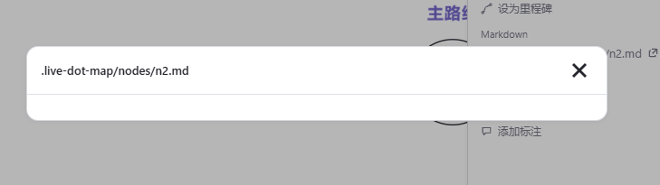
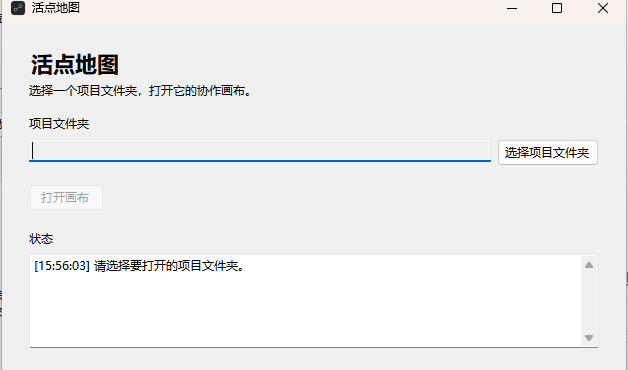

# 8-14 实测记录

> 用途：以真实用户视角记录从安装、连接、初始化到人机协作的全部不顺之处。
> 记录原则：先写事实、用户预期和截图；具体改法在测试结束后统一讨论，不在本文件里抢先定方案。

## 当前整改状态总览（2026-08-14）

本表是原始记录之上的当前状态层。原始记录中的 `[ ]` 保留当时的人工验收事实，不代表修复没有实施；“自动关闭”只表示代码/协议已有对应自动证据，“手工待验”表示仍须用户按真实新手路径点击确认。手工验收统一从新安装包开始，先在 `D:\LiveDotMap-Test`，再视需要在真实项目 `E:\壁纸制作` 复测。

| 记录 | 当前自动/真实状态 | 证据命令或证据 | 仍需用户手工体验 |
|---|---|---|---|
| 01 安装位置与项目选择 | **自动关闭，手工待验** | `npm run verify:windows-installer`：安装位置选择、无项目首屏、独立安装根通过 | 新安装包在 D 盘选择安装目录，确认不把软件安装与项目连接混在一起 |
| 02 损坏 `current` | **自动关闭，手工待验** | `npm run verify:windows-installer`：旧/不完整 payload 自动备份修复通过 | 用旧版本/损坏目录真实点击主按钮，确认不要求用户手删 `current` |
| 03 地图重命名 | **自动关闭，手工待验** | `npm run test:core`、`npm run verify:web`：`set_meta`、稳定 Markdown 路径和画布构建通过 | 在 D 盘实际画布改名、刷新，确认标题保存且 Markdown 路径不移动 |
| 04 桥连接与 Agent 状态 | **Codex 真实关闭；UI/其他 Agent 待验** | `LIVEDOT_USE_GLOBAL_CODEX=1 npm run verify:real-codex`：真实 Codex MCP 写回 revision `0→1`；`node --test tests/bridge/*.test.mjs`：会话恢复/自动检测通过 | 在 D 盘实际 UI 刷新/重开，确认不是降级；Claude/Kimi/CodeBuddy/WorkBuddy 尚未完成真实生命周期验收 |
| 05 问题节点与 Markdown | **自动关闭，手工待验** | `npm run test:core`、`node --test tests/bridge/*.test.mjs`、`npm run verify:web`：问题语义、Markdown 原子读写/冲突/reveal 通过 | 在画布右键设问题、编辑保存并打开真实 `.md`，确认红色显示和可书写闭环 |
| 06 桌面入口名称 | **自动关闭，手工待验** | `npm run verify:windows-installer`：产品快捷方式、旧“本地桥”入口迁移/清理通过 | 查看桌面和开始菜单只显示“活点地图”，双击确认能自动启动而不暴露“本地桥” |
| 07 空白画布/启动阻断 | **自动关闭，手工待验** | `npm run verify:web` + Chromium 强模式烟测：启动不再因空引用中断 | 在 D 盘新项目实际打开空白画布，新建节点并保留截图；再按需要复测 `E:\壁纸制作` |

### Agent 平台门禁

- [x] **Codex CLI**：真实全局登录会话已完成 `map_get_context → map_validate → map_apply_commands`，节点来源与 health 记录均通过；证据详见文末“真实 Codex 接入验收收口”。
- [ ] **Claude Code**：尚无真实模型生命周期闭环证据。
- [ ] **Kimi Code**：尚无本轮真实模型生命周期闭环证据。
- [ ] **CodeBuddy / WorkBuddy**：仅有适配器或进程级证据，桌面端真实生命周期未验收。

## 测试环境

- 日期：2026-08-14
- 真实工作项目：`E:\壁纸制作`
- 旧地图处理：原 `.live-dot-map\map.json` 已完整备份至 `E:\活点地图历史备份\壁纸制作-2026-08-14\map.json`，当前项目将建立新的测试地图。
- 测试入口：`dist\windows-installer\LiveDotMapSetup.exe`
- 测试目标：模拟非程序员用户首次安装并在真实项目中启用人机协作。

## 收口字段索引（实施与验收唯一入口）

下表把每条实测统一为“原问题 → 当前根因/改动 → 自动证据 → 人工待验”。“通过”只表示对应自动检查真实通过；没有自动或人工证据的项目保持“待验”，不把计划当完成。

| 记录 | 原问题 | 当前根因 / 改动状态 | 自动证据 | 人工待验 |
|---|---|---|---|---|
| 01 | 安装器把软件安装与项目连接混在首屏，安装位置不可见 | 安装器入口已拆出软件位置选择；是否覆盖三种父目录分支仍待实测 | `verify:windows-installer` 已确认可选安装位置且不要求项目选择 | 三种父目录/已有目录不重复嵌套，普通用户理解无歧义 |
| 02 | 旧 `current` 被误报损坏并要求用户手删 | 根因是旧 payload 校验失败没有走自动修复；主流程已增加修复/更新路径 | Windows UI 自动检查 `corruptInstallAutoRepaired:true` | 使用真实旧版本 payload 点主按钮，确认不要求手动删除且继续打开 |
| 03 | 地图标题只能显示文件夹名，无法重命名 | 需要 `set_meta` 显式改地图名且不移动 Markdown；画布入口由专责任务实现 | 核心 reducer 已覆盖 `set_meta` 与稳定 Markdown 路径 | 右键/点击标题改名并刷新，文件路径保持不变 |
| 04 | 项目已连接却显示降级，刷新丢桥会话；接入 Agent 重复复杂 | 根因是一次性 token 从地址栏移除后刷新未恢复会话；桥已增加 cookie 恢复和项目打开时 Agent 自动检测 | bridge 测试覆盖会话恢复、Agent 状态和 project open 返回 setup 状态；真实 Codex 已完成 MCP 写回（见文末收口） | 新安装包刷新/重开页面仍显示真实协作状态，并只提示当前可用 Agent 的首次信任 |
| 05 | 问题节点语义缺失；Markdown 只能显示路径、不能书写 | 根因是画布旧文件授权路径与桥 Markdown API 未接通；协议已增加问题节点与 Markdown read/write/reveal | bridge 测试覆盖空文件初始化、原子保存、冲突与 reveal | 画布右键设为问题节点、红色显示；点击 Markdown 可编辑、保存、打开真实文件 |
| 06 | 桌面入口暴露“活点地图本地桥”内部名称 | 根因是快捷方式直接指向桥实现；产品入口与桥职责需拆开 | Windows UI 自动检查存在产品快捷方式、旧快捷方式移除 | 桌面/开始菜单只显示“活点地图”，双击自动拉桥，不出现“本地桥” |
| 07 | 第二次测试的安装目录、启动阻断和空白画布问题 | 见本节 07-A～07-C；空白画布根因已定位为启动时 null 元素绑定 | 安装器无项目选择、构建与桥自动测试已通过对应部分 | 见 07-A～07-C 各自清单，全部需新安装包人工复测 |

## 记录 01：安装器把“安装软件”和“连接项目”混在同一页

### 用户动作

双击安装包，进入首个窗口。

### 用户预期

第一步应该是安装软件：能够看到默认安装位置，并可选择是否更改。选择项目文件夹应当发生在产品安装完成、用户第一次需要连接某个项目时。

### 实际看到的内容

- 首屏直接要求选择“项目文件夹”。
- 没有显示软件会安装到哪里，也没有“更改安装位置”的入口。
- “打开安装位置”只是查看当前安装目录，不是选择安装目录。
- 用户自然无法判断：自己正在安装软件，还是正在授权某个项目。



### 原始状态文字

```text
[13:06:34] 安装包已校验：版本 2.0.0。安装将只写入当前 Windows 用户目录，不请求管理员权限。
```

### 待汇总问题

- [ ] P0 新手流程：软件安装位置不可见、不可选择。
- [ ] P0 新手流程：安装软件和连接项目被混为一个步骤。
- [ ] UI 文案：“项目文件夹”在安装首屏缺少上下文，容易误解。

## 记录 02：旧安装被误报为“损坏”，要求用户手动删除内部目录

### 用户动作

在安装器中选择真实项目 `E:\壁纸制作`，点击“安装并开始使用”。

### 实际结果

安装器提示已有安装损坏，并要求用户在“打开安装位置”中手动移除 `current` 文件夹后重试。该目录内恰好包含安装器 exe 和 payload，普通用户无法判断是否能删、删后如何恢复。

### 原始状态文字

```text
[13:14:06] 已选择项目：E:\壁纸制作
[13:14:20] 未完成：已有安装损坏，请先在“打开安装位置”中移除 current 文件夹后重新运行安装包。
```

### 已核对的事实

- 该目录为旧版安装：`C:\Users\Thomas\AppData\Local\LiveDotMap\current`。
- 它不是普通用户应手动维护的目录。
- 当前提示把旧版 payload 不满足新版校验的情况表述为“安装损坏”，并把替换责任交给用户。
- 当前界面已有“修复 / 更新”按钮，但主流程没有自动调用它。

### 待汇总问题

- [ ] P0 恢复流程：主按钮遇到旧版/不兼容安装时，应自行安全修复或明确引导到“修复 / 更新”，不能要求用户删除 `current`。
- [ ] P0 流程连续性：修复/更新成功后，应继续完成已选项目的连接，而不是让用户自行猜测下一步。
- [ ] 错误文案：不要将可修复的版本不兼容直接称为“安装损坏”。

## 记录 03：地图标题无法重命名

### 用户动作

成功进入画布后，尝试右键左上角显示的地图名称“壁纸制作”，希望将地图改成更符合当前工作内容的名字。

### 用户预期

左上角名称是当前地图名称，而不是不可修改的项目文件夹标签。用户应能通过右键、点击或其他明显入口重命名地图。

### 实际结果

- 左上角显示“壁纸制作”，与项目文件夹同名。
- 标题区域没有可编辑提示，也没有重命名入口。
- 右键名称不能重命名。
- 可见的只有保存状态和右侧菜单图标，无法判断菜单是否承担地图名称管理。


### 待汇总问题

- [ ] P1 地图身份：地图名称与项目文件夹名称被混同，用户无法表达“这个项目中的局部地图”。
- [ ] P1 可发现性：地图名称必须有直接、低学习成本的重命名入口；不应要求用户猜测右键或深层菜单。
- [ ] P1 信息架构：需明确区分“项目文件夹名称”“地图名称”和“当前路线/工作主题”。

## 记录 04：项目已选择、画布却显示降级；“接入 Agent”流程重复且难以理解

### 用户动作

完成安装器中的项目选择后进入浏览器画布；看到右下角“接入 Agent”，打开设置抽屉查看连接状态和项目文件夹。

### 用户预期

用户已经安装产品并选择了项目，接下来只应有一个清楚的“接入 Agent”动作：可以由产品自动完成，或由用户在当前 Agent 对话框发送一条接入指令。完成后，画布应明确显示“已连接到当前 Agent”。

用户不应再次选择项目文件夹、阅读协议文件、面对多个自己并未使用的 Agent，也不应看到互相矛盾的“已连接”和“降级模式”。

### 实际结果

- 画布右下角仍显示“接入 Agent”，无法判断是否已经连接。
- 设置页又要求“选择项目文件夹”和“给 Agent 贴协议”；这与安装器已经选择项目的动作重复。
- 设置页显示项目文件夹“已连接：壁纸制作”，但画布状态为“降级模式”。
- `codex / claude-code / kimi-code / codebuddy` 都显示“待信任”；用户无法判断自己实际使用的 Agent 是否已接入。
- 页面展示大量底层说明（`map.json`、`AGENTS.snippet.md`、安全边界、四个 Agent 状态），对非程序员用户是配置负担，不是“一步接入”。


### 已核对的事实

| 层级 | 当前实际状态 |
|---|---|
| 项目地图 | 已创建 v2 `map.json`，项目文件夹已配置 |
| 本地桥 | 正在本机 loopback 端口运行 |
| 当前画布标签页 | 降级模式，未处于可靠协作状态 |
| Agent | 四个适配器均为“待信任”，不能视为已连接 |

已定位一个造成状态矛盾的技术缺陷：页面首次建立本地桥会话后，会从地址栏删除一次性启动令牌；但页面刷新时仍要求该令牌，导致本地桥继续运行、画布却错误进入“降级模式”。

### 待汇总问题

- [ ] P0 真实性：项目文件夹已配置、本地桥已运行、画布却显示降级，连接状态不可信。
- [ ] P0 可靠性：刷新页面后不能丢失强协作会话，不能把正常本地桥误判为降级模式。
- [ ] P0 新手流程：安装后不应重复选择项目文件夹；“连接项目”和“接入 Agent”需要各自只有一次明确动作。
- [ ] P0 一步接入：默认只展示用户当前可用的 Agent 及一个下一步，不罗列四个平台和底层协议步骤。
- [ ] P1 文案与信息密度：`map.json`、协议文件、信任机制和安全边界应收进帮助层，不能成为主流程说明。

## 记录 05：问题节点语义不直观；Markdown 详情不能实际书写

### 用户动作

1. 在画布中新建普通节点后右键，尝试把它标记为项目推进中遇到的“问题”。
2. 点击节点的“打开 Markdown”，希望进入该节点的详细记录并补充问题、证据与想法。

### 用户预期

- 应有直接、可理解的“设为问题节点”动作；问题节点在画布上为红色，并在数据中与普通节点明确区分，让 Agent 全局读取时优先知道当前问题。
- 点击 Markdown 后应直接打开可书写的详情：至少能在产品内编辑并保存，或可靠地在系统默认编辑器中打开真实文件；不能只展示文件相对路径。

### 实际结果

- 右键菜单仅提供“升级为问题路线”。它更像把节点改为一条路线的起点，不能让用户清楚地表达“这是一个问题节点”。
- 首次点击 Markdown 时出现短暂的失败提示；再次点击后只出现一个空白弹窗，标题是 `.live-dot-map/nodes/n2.md`，没有编辑区或“在文件夹中打开”的实际操作。
- 已核对 `E:\壁纸制作\.live-dot-map\nodes\n2.md`：文件确实已创建，但大小为 `0` 字节。因此画布展示空白并不等于可写详情，用户也无法借由该入口进入真实 Markdown 文件。

### 只读技术排查结论

- 不是权限问题：`n2.md` 与 `nodes/` 目录可读写，本地桥健康运行，项目地图已加载。
- 根因是两套路径没有接通：当前“打开 Markdown”只使用浏览器的文件夹授权（`IO.dir`）；而本地桥虽已打开项目并加载地图，却没有 Markdown 读取、写入或打开接口，也不会给画布设置该浏览器授权。因此在本地桥协作模式下，该操作会直接失败。
- 即使浏览器文件夹授权成功，现有弹窗也只是只读文本预览，没有编辑器、保存按钮或调用系统编辑器的能力；缺失文件被创建后也只提示“已创建”，不会继续进入编辑。
- 首次失败提示短暂出现，是因为该操作没有就绪状态、重试或可恢复指引；不是用户操作错误。
- 现有“升级为问题路线”会把节点标为 `type: "问题"` 并新建/归并一条路线，但 schema、检索与画布都没有独立的问题节点语义；现有样式仅为深色虚线，不是红色问题节点。




### 待汇总问题

- [ ] P0 节点语义：新增独立“问题节点”类型/状态与红色画布表达；不再以“问题路线”替代问题本身。
- [ ] P0 Agent 上下文：问题节点须进入地图 schema 与检索/摘要优先级，使 Agent 能明确识别项目的未解决问题。
- [ ] P0 Markdown 详情：打开入口必须提供真实可编辑的详情闭环；空路径弹窗不能算“已打开”。
- [ ] P0 失败反馈：Markdown 创建、读取或写入失败时保留明确错误与可恢复操作，不能一闪而过后让用户无从判断。
- [ ] P1 兼容迁移：保留旧“问题路线”信息可读；新增正式问题节点后不能让已有地图的节点、路线或 Markdown 丢失。

## 记录 06：桌面快捷方式暴露“本地桥”内部名称

### 用户动作

安装后在桌面查看产品快捷方式。

### 用户预期

桌面入口应当是产品入口：名称是“活点地图”，双击后打开产品。用户不需要、也不应被要求理解“本地桥”这一内部组件。

### 实际结果

- 快捷方式名称显示为“活点地图本地桥”（图中因换行显示）。
- 图标是带齿轮的小窗口，更像工具/服务程序，不像用户要打开的产品。
- 用户会自然困惑：这是产品本体、一个配置工具，还是需要额外打开的技术组件？


### 待汇总问题

- [ ] P0 产品边界：桌面快捷方式、开始菜单和窗口标题统一使用“活点地图”；本地桥只作为内部运行组件。
- [ ] P1 可理解性：入口图标应表达“打开活点地图”，不能以齿轮/服务形象暗示用户需要配置技术组件。
- [ ] P0 流程：双击产品入口后由产品自行按需拉起本地桥；用户无需也不应单独启动桥。

## 记录 07：第二次测试——安装目录、启动入口与空白画布（原 `8-14第二次测试.md`）

> 本节将第二次测试并入本台账；原始截图保留在 `docs/8-14第二次测试.assets/`。本节只记录当时事实和当前状态，未完成项仍保持未勾选。

### 07-A 安装位置应自动包含产品目录名

**原问题 / 用户预期**

安装器显示“软件安装位置”，用户希望选择父目录后自动得到稳定的产品目录，例如选择 `D:\` 最终使用 `D:\livedotmap`；选择已有 `D:\livedotmap` 时不能重复嵌套。产品文件不能散落到父目录。


**当前根因 / 改动状态**

- 截图只确认当时界面展示了 `D:\livedotmap` 和“更改位置”。
- 还没有从用户选择 `D:\`、选择 `D:\应用`、选择已有 `D:\livedotmap` 三个分支完成同一安装器复测；本台账不把界面截图当作全部通过。

**自动证据**

- `npm run verify:windows-installer` 的隔离 UI 检查已覆盖“选择安装目录、无项目选择、产品快捷方式、损坏安装自动修复”；该自动证据不替代上述三个手动路径分支。

**人工待验**

- [ ] 选择 `D:\` 后预览和实际目录为 `D:\livedotmap`。
- [ ] 选择 `D:\应用` 后预览和实际目录为 `D:\应用\livedotmap`。
- [ ] 直接选择已有 `D:\livedotmap` 不变成 `D:\livedotmap\livedotmap`。
- [ ] 父目录不出现散落的 exe、运行库或 payload。
- [ ] 安装目录、开始菜单、桌面入口和卸载项统一使用“活点地图”。

### 07-B 安装后不应阻断在“选择项目文件夹”窗口

**原问题 / 用户预期**

安装完成后产品先弹出项目文件夹选择，用户无法先看到正式画布。参考 DeepSeek Harness，工作区应是画布内的小入口，可添加/切换；未选择工作区时也应能打开画布和连接 Agent。




**当前根因 / 改动状态**

- 该问题属于产品入口和工作区状态编排，不能用“把弹窗文案改短”代替。
- 产品默认目录、真实项目目录的地图迁移/关联和备份策略仍需在真实新用户流程中确认；本台账不把安装器自动化测试误判为画布入口已通过。

**自动证据**

- Windows 安装器 UI 自动检查已确认安装器不要求项目选择（`noProjectSelection:true`），但尚未覆盖画布内添加/切换工作区及无工作区创建节点。

**人工待验**

- [ ] 安装完成直接进入正式画布，不弹出必须先选项目的阻断窗口。
- [ ] 画布提供克制的工作区入口，可添加、切换和移除工作区。
- [ ] 不选工作区时仍可创建地图、节点和 Agent 连接。
- [ ] 无工作区记录写入稳定的产品默认目录且可查。
- [ ] 选择真实项目后写入项目 `.live-dot-map/`，不覆盖默认地图。
- [ ] 默认目录切换到项目目录有明确、可恢复的迁移/关联提示。
- [ ] 主画布不把“本地桥”“MCP”“hook”“项目根目录”作为必懂术语。

### 07-C 空白画布无法新建节点（P0）

**原问题 / 用户预期**

正式画布看似打开，但“新建节点”与空白画布点击无效，没有错误、离线或恢复提示；核心功能被阻断。


**当前根因 / 改动状态**

- 已完成只读定位：`app.html` 启动代码曾引用不存在的 `#drawer-open-kit` 并直接设置 `onclick`，触发 `Cannot set properties of null (setting 'onclick')`，导致 pointer/click、首次渲染、桥初始化全部中断。
- 已核对源码、`dist/app.v2.html`、`.deploy/app.html` 与 Windows payload hash 一致；因此当时不是用户误装旧版本。
- 修复由画布专责任务负责；本台账只接受修复后新安装包的真实点击证据，不提前勾选。

**自动证据**

- [ ] 页面启动不再抛出异常。
- [ ] 自动化在无工作区、默认目录、真实项目三种状态均能创建节点。
- [ ] 失败状态显示明确错误和恢复操作，不能保留“可点击但无效果”的工具。

**人工待验**

- [ ] 使用新安装包在隔离项目点击“新建节点”后空白处可创建并显示节点。
- [ ] 在 `E:\壁纸制作` 真实工作目录重复上述动作并保留修复后截图。

## 后续记录模板

复制这一段继续追加；每条尽量附截图或原始文字。

```markdown
## 记录 NN：一句话问题标题

### 用户动作

### 用户预期

### 实际结果

### 截图 / 原始文字

### 待汇总问题

- [ ]
```

## 真实 Codex 接入验收收口（2026-08-14）

本节是本台账中 Agent 连接状态的真实证据；不以模拟进程或 mock MCP 代替真实客户端。

### 通过证据

- [x] 使用当前全局、已登录的 Codex CLI，在 `D:\LiveDotMap-Test\livedot-real-codex-init-owhHcE` 临时项目运行；未设置隔离 `CODEX_HOME`，未跳过 hook 信任。
- [x] 真实会话完成 `map_get_context → map_validate → map_apply_commands`。
- [x] 使用当前协议 reducer 命令 `{op:"create", collection:"nodes", value:{...}}` 写回成功；revision `0→1`。
- [x] 节点 `real-codex-initialized` 出现，`createdBy=agent:codex`；Agent health 事件为 `mcp:map_apply_commands`。

### 失败尝试与根因（保留，不计为通过）

- `D:\LiveDotMap-Test\livedot-real-codex-init-1Ovbvf`、`D:\LiveDotMap-Test\livedot-real-codex-init-AAaQoj`：隔离 `CODEX_HOME` 无用户凭据，Codex API 返回 `401 Missing bearer/basic auth`；后者的隔离配置目录为 `D:\LiveDotMap-Test\livedot-real-codex-home-zTFr57`。
- `D:\LiveDotMap-Test\livedot-real-codex-init-zG4Y3B`：全局登录和 MCP 均正常，但验收提示词错误使用 `type:create_node`，服务端按协议拒绝，revision 保持 `0`；修正 reducer schema 后通过。

### 临时目录状态与边界

- [x] 上述目录均位于 `D:\LiveDotMap-Test`，因 `LIVEDOT_KEEP_REAL_CLIENT_TMP=1` 保留审计；没有读取或输出用户认证文件，也未触碰 `E:\壁纸制作`。
- [ ] Claude、Kimi、CodeBuddy/WorkBuddy 桌面生命周期和普通小白新安装仍需按本台账的人工门禁验证；本次 Codex 证据不能替代它们。
