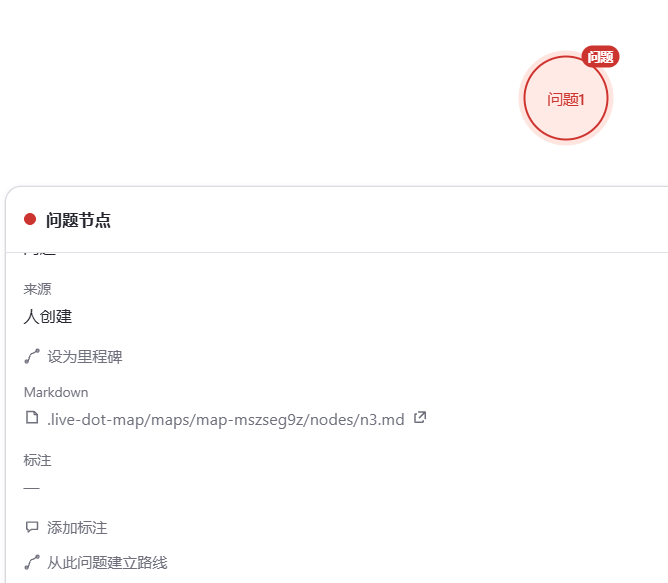
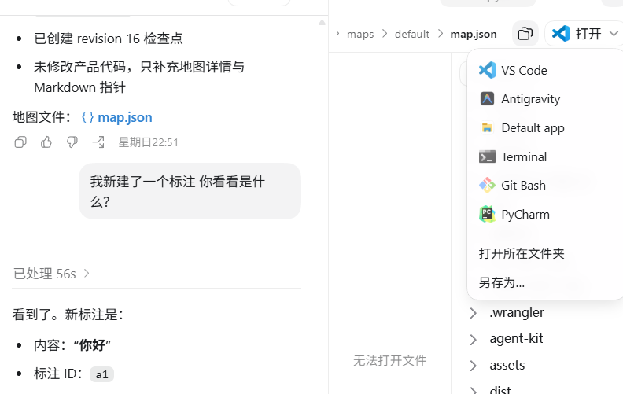
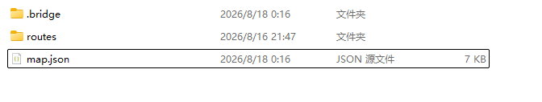
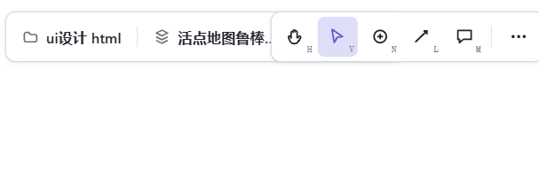
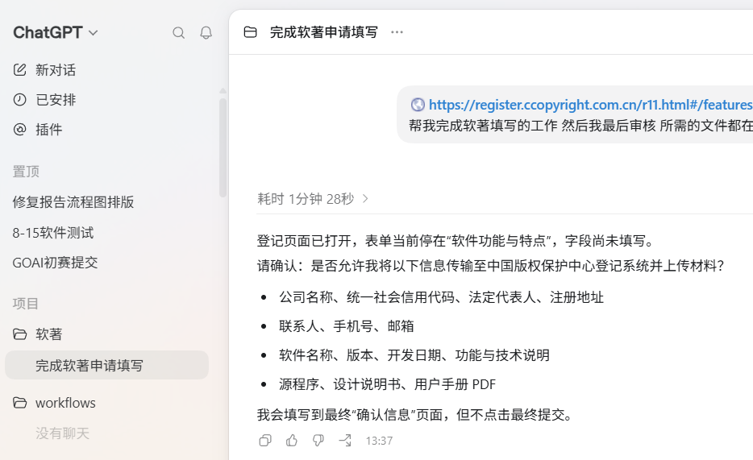
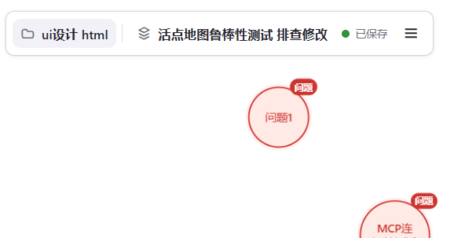
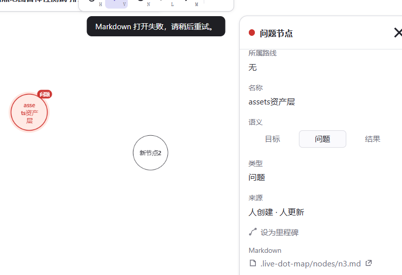

1.第一个关于这个具体问题 的 我想的是 这个

问题 我想是要像codex一样 可以像codex一样 让用户用自己的程序打开 用户习惯自己的编辑器 而且 就像我更喜欢vscode 因为里面我可以粘贴图片路径呀

你看就像codex这个 旁边有这么多打开方式都是用户自己的 而我们的应用内的编辑器 不能粘贴文件路径 很麻烦

2 

我觉得这个设置为里程碑这个功能没什么用 没用就不要乱加 保持简洁

3.

这个语义和 类型我觉得重复了 应该合并成一个 语义 分为普通 问题 和结果 三个 嗯 目前就暂定这样 然后是这样的 人创建的时候默认普通 也可以调整 问题节点就是红色的  结果就是蓝色的 然后也是双向操作 人可以调整 agent也可以任意调整选择类型

4.这个记忆的数据结构我觉得还是不对

目前我觉得是这样的 我们route里面只有md文件 因为我习惯的是 一个问题用图片加文字来描述吗 有可能还有多种类型的 比如 word pdf 各种 所以说我觉得得建立一个assets资产层 专门存放这些除了文字以外的类型 本身用户只用操作md文件 然后md文件里可以粘贴这些格式的路径嘛对吧 你说怎么个修改方式比较好 可以给我推荐一下

5.就是现在是这样的 我发现我真正使用codex的时候 我给你说一下我的场景 当我 在这个选择栏选择这个软著文件夹 
codeX也选择这个文件夹的时候 只要我没有新建地图 codeX就会报错 无法对话 我记得就是livedotmap的mcp报错的 这个怎么修呢 还是刻意设计的

6.我发现 就是目前好像没有专门的手段往一个节点的md文档里精确的写文档的命令 是不需要嘛 还是怎么说 这是怎么回事 怎么修

7. 我刚创建的这个测试节点是 kind:problem 的问题节点——按协议 delete 只有人类能用，我删不掉它，你在画布上选中按删除键
    agent 创建节点 也应该能删除节点 不需要这个协议
8.cli 好像没有新建地图的命令欸 违反了人机双向同步 所有人能做的agent都能做的规范 你根据测试结论看看怎么修改

 测试结论如下：

   能通的
   • 连接 OK:MCP 通道正常，map_get_context 拿到了当前地图（「活点地图鲁棒性测试 排查修改」,revision 17)。
   • 当前地图建节点 OK:map_apply_commands 的 op:create + collection:nodes 成功，revision 17→18，画布上多了一个
     n-agent-new-1(「Agent新建节点测试」,createdBy: agent:kimi)。

   卡点：Agent 侧没有任何「新建地图 / 切换地图」的入口，我排查了全部四条路：

   1. MCP 工具集——只有 map_get_context / map_apply_commands / map_validate / map_next_candidates / map_checkpoint /
      map_plan_consolidation / map_list_human_updates / map_ack_human_updates 等，没有 map create/switch 工具。
   2. 命令通道——docs/agent-protocol.md:50 明确规定 map_apply_commands 只接受 nodes|edges|routes|anns 的
      create/update/delete 加 set_meta/set_view/set_ui。我实测发了 collection:"maps" 的 create，被拒绝了。
   3. REST 桥——POST /api/v1/maps/create|switch 确实存在（src/bridge/server.mjs:917)，但要求会话 Cookie + CSRF，而会话只
      能由一次性 bootstrap token 换取——那个 token 在画布 UI 启动时就被消费掉了，Agent 拿不到凭证，这条路只对 UI 开放。
   4. CLI——livedot.mjs 只有 install/serve/mcp/hook/doctor/uninstall，没有 map 子命令。

   剩下的唯一「办法」是直接改 .live-dot-map/active-map 和手写 map.json，但这违反「正式协同模式只能通过本地桥提交命令」
   ，还会和运行中的桥 WAL 冲突，不算可行路径。

   顺带发现的一个小问题：拒绝 collection:"maps" 时报错文案是「新对象 ID 无效」，和真实原因（不支持该 collection / 未知
   op）不匹配。协议要求「未知 op 必须返回显式错误」，错误是显式了，但信息会误导排查。

   修复建议（供你参考）：给 Agent 侧补一个地图管理入口，比如在命令通道加 map_create / map_switch 操作，或新增 MCP 工具
   map_create/map_switch/map_list，内部走桥的同一套会话鉴权逻辑，保持 WAL、revision 和事件流一致。

9.
地图上没有一个状态栏 我不知道这个地图到底有没有跟agent连通成功 只在agent去问我才知道 然后本地桥没有启动 也会报错 有时候 本地桥会被关掉 然后只剩浏览器界面 就会报错 普通用户不懂原理的会骂人

10 新建节点出现md打开失败 请稍后重试的问题？怎么回事

11.问题 我觉得嗷 问题这个节点 应该允许多个md文件的创建 因为人的思维天然就是结构性的 可能一个md文件描述不了一个问题  然后这个md文件 能否支持在ui里直接重命名呢？
